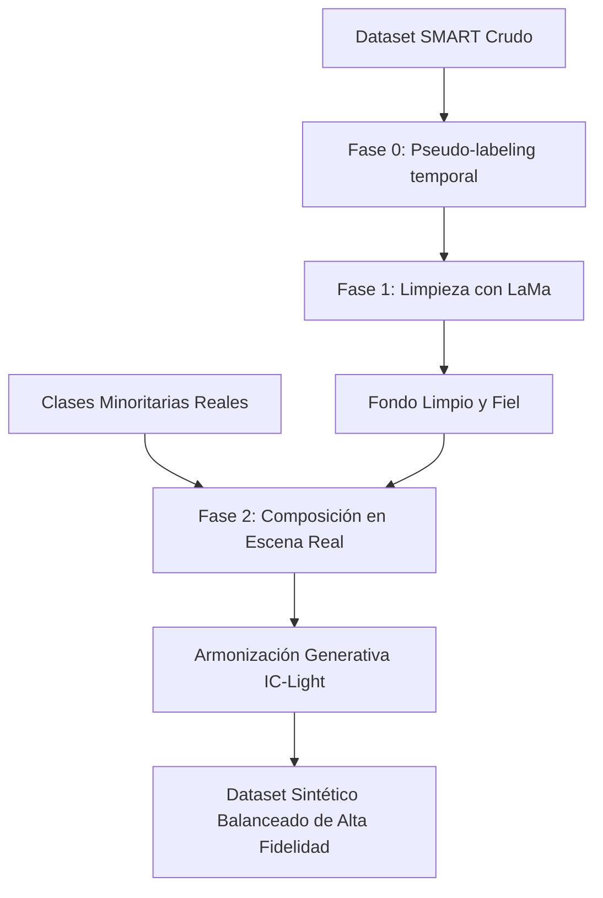

# Reporte de Evaluación Crítica y Validación de Plan de Investigación

**Documento Evaluado:** [05.nuevo-plan-gemini.md](file:///home/alvaro9rqc/1_Pacha/1-unsa/7_S/ia/article/.alvaro/00_nueva_info/01_plan_augmentation/05.nuevo-plan-gemini.md)
**Rol:** Revisor Académico Principal / Investigador de Visión Computacional
**Fecha de Evaluación:** 13 de julio de 2026

---

## 1. Validación de la Hipótesis de Datasets de Tráfico en el Contexto Peruano

En el plan evaluado se menciona que: *"Una de las mejoras para ayudar con su estudio es la detección de vehículos mayoritariamente peruanos y en la zona de Perú, pero no hay muchos datasets disponibles"*.

### 🔍 Resultados de la Auditoría y Búsqueda del Estado del Arte
La afirmación sobre la escasez de datasets públicos para el contexto específico de Perú es **correcta pero requiere ser precisada técnicamente** para evitar que un revisor rechace la premisa del estudio. Se identificaron las siguientes iniciativas locales y regionales:

1. **DS-ivic Dataset (Cusco, Perú):**
   * **Descripción:** Dataset de 2,866 imágenes anotadas que clasifica vehículos (autos, buses y camiones) en condiciones de congestión reales bajo la morfología urbana de Cusco. Ha sido utilizado para entrenar modelos YOLOv7 enfocados en estimación de densidad vehicular.
   * **Diferencia con SMART Challenge:** No está tomado en tomas aéreas/nadir puras de dron (perspectiva inclinada de baja altura) y no cuenta con cajas delimitadoras orientadas (OBB), sino bounding boxes tradicionales horizontales (HBB).

2. **Avenida Arequipa Traffic Dataset (Lima, Perú):**
   * **Descripción:** Conjuntos de datos extraídos de tomas de cámaras de vigilancia urbana fijas a lo largo de la Av. Arequipa para sistemas inteligentes de monitoreo (ITS). Incluye anotaciones de autos, buses, motos, ciclistas y peatones.
   * **Diferencia con SMART Challenge:** Carece de la perspectiva nadir del dron del SMART Challenge, la cual es crítica para la orientación de cajas de 360 grados y cuenta con menor resolución angular.

3. **UTUAV (Urban Traffic UAV Dataset - Medellín, Colombia):**
   * **Descripción:** Aunque no es peruano, es el dataset regional más similar que comparte el comportamiento vehicular y la flota heterogénea (alto volumen de mototaxis/motos y transporte colectivo informal) característico de las ciudades peruanas. 

> **Conclusión sobre la Novedad del Dataset:**
> El dataset de la competencia **SMART Challenge (MTC 2026)** es el primer dataset aéreo con etiquetas OBB y clips temporales continuos de intersecciones urbanas de Lima Metropolitana. Por lo tanto, la premisa de que no hay datasets robustos orientados y representativos de la costa/nadir peruana es **sólida y defendible**, pero en la introducción del artículo se debe citar a *DS-ivic* y *UTUAV* como el estado del arte regional actual en datasets de tráfico latinoamericano.

---

## 2. Coherencia Interna y Novedad Metodológica

El pipeline propuesto consta de 3 fases que buscan mitigar el desbalance extremo de clases (ej. ómnibus articulados 0.04% vs autos 80%) y limpiar el ruido de etiquetas (vehículos estacionados que el dataset original omitió deliberadamente por estar fuera de su objetivo de movimiento).

### 2.1 Puntos Fuertes e Innovadores
* **Detección de Omisiones mediante Estabilidad Temporal (Fase 0):** Explotar la información temporal de los clips (~50 frames) cruzando detecciones de un YOLO ligero con el ground-truth original para inferir que los vehículos estáticos no anotados son "vehículos estacionados" es una solución elegante y de bajo costo.
* **Inpainting como Corrector de Ruido de Etiquetas (Fase 1):** Utilizar **LaMa** no para modificar la semántica de la escena ni para inpainting de rostros, sino para **sanitizar los píxeles de los vehículos estacionados** y convertirlos en asfalto, evita penalizaciones al detector objetivo final. Esto está teóricamente respaldado por [[Fatima2025]], que muestra cómo la presencia de objetos en fondos altamente correlacionados (como pavimentos urbanos con cámaras fijas) introduce un fuerte sesgo de memorización de fondo en detectores deep learning.

### 2.2 Relación con el Estado del Arte (¿Es algo repetido?)
Cada componente individual ya ha sido implementado, pero su integración específica para el problema del ruido y desbalance de tráfico aéreo es novedosa:
1. **LaMa para limpieza de fondo:** Ya fue usado por [[Zhang2026]] en imágenes de vista cenital de estacionamientos (AVM) para borrar marcas viales y por [[Fatima2025]] para diagnosticar sesgos.
2. **ControlNet para aumentación:** [[Benkedadra2024]] (CIA) y [[ZhuJ2024]] (ODGEN) ya han demostrado la viabilidad de usar ControlNet para aumentaciones controladas espacialmente en YOLOv8 y YOLOv5.
3. **El paradigma "Erase, then Redraw" (Borrar y luego Redibujar):** Fue introducido formalmente por **Ma et al. (2024a)** para conducción autónoma. El plan se alinea a esta filosofía y debe citarla directamente.

---

## 3. Evaluación de las Elecciones Tecnológicas

### 3.1 LaMa para Inpainting (Fase 1) — **Aceptable y Justificado**
* **Ventajas:** Basado en Fast Fourier Convolutions (FFC), lo que le da un campo receptivo global desde las primeras capas. Es excelente para reconstruir texturas repetitivas (asfalto, líneas de carril continuas) con muy baja latencia frente a los modelos de difusión.
* **Soporte del Corpus:** [[Liu2026]] comparó LaMa con MAT y TFill en su estudio de ablación (Tabla 3), y LaMa los superó ampliamente logrando un MAE de 0.053 (reducción del 12-15% en error de reconstrucción). [[Zhang2026]] también eligió LaMa para limpiar fondos de carreteras.

### 3.2 ControlNet + Poisson Blending (Fase 2) — **Punto Débil Crítico**
El plan propone usar ControlNet para generar fondos de vías sintéticas a partir de mapas procedimentales, y luego mezclar las clases raras reales usando **Poisson Blending (Pérez et al., 2003)**. Esta combinación presenta serias deficiencias según la literatura reciente:

1. **Inconsistencias espaciales de ControlNet:** [[ZhuH2025]] (ReCon) demuestra que ControlNet o GLIGEN carecen de control estricto a nivel de píxel y a menudo desplazan o deforman los objetos fuera de las coordenadas de las cajas de anotación original (bounding box drift), lo que arruina el entrenamiento de detectores.
2. **Poisson Blending genera artefactos visuales:** Pegar parches 2D mediante Poisson Blending no resuelve la incoherencia de iluminación global ni las sombras. [[HuangW2025]] (SOC) demuestra que las redes de detección memorizan los "bordes duros" e imperfecciones de iluminación del copy-paste, aprendiendo correlaciones incorrectas.
3. **La ganancia de la Armonización Generativa:** El estudio de ablación de [[HuangW2025]] en la tarea de composición muestra que cambiar copy-paste por **Armonización Generativa (como IC-Light) + mezcla de color reponderada** eleva el AP de **6.28 AP a 12.79 AP (una mejora del +103.7%)**.
4. **Poisson Blending está en desuso:** En el corpus de 52 artículos, solo [[Zhang2026]] utiliza Poisson Blending para sintetizar líneas de estacionamiento simples, mientras que las propuestas de detección más avanzadas han migrado a modelos de relighting y armonización espacial.

---

## 4. Rediseño del Plan de Aumentación (Recomendado)

Para evitar el desvío sim-to-real y eliminar el uso excesivamente costoso e impreciso de ControlNet para generar "asfalto sintético", se propone la siguiente **simplificación y mejora del pipeline**:

### Modificación del pipeline de Aumentación:

1. **No generar vías con ControlNet:** En su lugar, utiliza los **propios fondos
   limpios reales generados por LaMa** en la Fase 1. Esto garantiza que la
   iluminación, escala geométrica y textura del asfalto sigan la distribución real
   del dataset del MTC peruano (sin domain gap).

2. **Composición espacial realista:** Extrae cultivos (crops) reales de las
  clases minoritarias (combi, mototaxi, ómnibus articulado) y colócalos en los
  carriles vacíos de los fondos de LaMa respetando la perspectiva 3D (siguiendo a
  [[HuangW2025]]).

3. **Sustituir Poisson Blending por Armonización Generativa:** Utiliza un modelo
   de relighting ligero (como IC-Light) para proyectar sombras y balancear los
  tonos cromáticos del vehículo sobre el fondo real de LaMa, reduciendo a cero los
  artefactos de borde.

---

## 5. Diseño de Experimentos y Ablación Refinado

El plan original define 5 condiciones. Se sugiere refinar y expandir ligeramente para contrastar con las baselines de aumentación clásicas:

| Condición | Estrategia de Datos | Propósito Científico |
|---|---|---|
| **Base 0** | Zero-Shot con pesos de DOTA. | Demuestra la necesidad de fine-tuning. |
| **Base 1** | Data Cruda original. | Línea base del dataset ruidoso original. |
| **Base 2 (Aumento Clásico)** | Data Cruda + Aumentaciones Clásicas de YOLO26 (Mosaic, Mixup, Copy-Paste estándar). | **CRUCIAL.** Demuestra si las técnicas generativas aportan más valor que el aumento por defecto de Ultralytics. |
| **Mejora A** | Dataset Limpio por LaMa (Fase 1). | Aísla el valor de eliminar el ruido de etiquetas de autos estacionados. |
| **Mejora B** | Data Cruda + Aumentación Generativa (Fase 2). | Evalúa si inyectar clases raras es útil cuando aún persiste el ruido de etiquetas base. |
| **Mejora C (Completo)** | Dataset Limpio por LaMa + Aumentación Generativa Armonizada. | Mide la sinergia final y el estado del arte propuesto. |

---

## 6. Riesgos Críticos y Puntos a Validar en Código

1. **Anotación de las Cajas Rotadas (OBB):** Al rotar o escalar las clases raras para colocarlas en el fondo limpio de LaMa, el script debe recalcular de forma exacta el ángulo de rotación $\theta$ en el formato SMART `cx cy width height angle_deg`. Cualquier desalineación geométrica destruirá el mAP, como advierte [[ZhuH2025]].
2. **Error de la Fase 0 (Pseudo-labeling):** Si el YOLO-nano inicial comete demasiados falsos positivos en la Fase 0, LaMa borrará vehículos en movimiento reales, lo que degradará el recall del modelo final. Se requiere evaluar la precisión de la Fase 0 antes de procesar el dataset completo.
3. **Métrica Macro AP:** Dado que la métrica SMART Challenge calcula el promedio no ponderado sobre las 9 clases, el impacto de la Fase 2 debe medirse no solo en el AP global, sino reportando el **AP individual por clase** para verificar que la combi y el mototaxi se ven beneficiados directamente.
