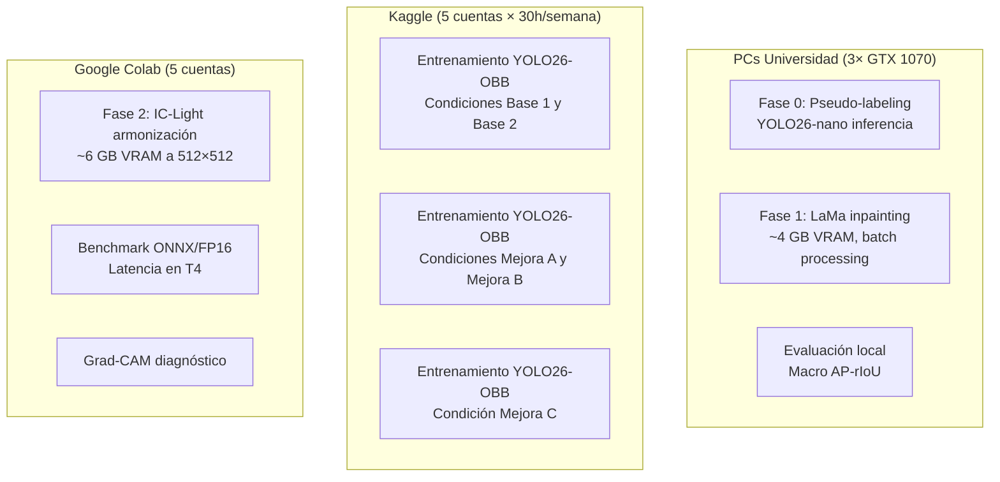

# Plan de Procedimiento Detallado
## Estudio de Ablación: Limpieza Generativa + Aumentación para Detección Vehicular OBB

**Ubicación de destino:** `/home/alvaro9rqc/1_Pacha/1-unsa/7_S/ia/article/.alvaro/01_procedimiento/`
**Fecha:** 14 de julio de 2026

> [!WARNING]
> **Propuesta histórica, superada por `00.p2.md` y por el plan de `plan/`.** El alcance vigente no
> incluye la Fase 2 con IC-Light ni las 6 condiciones de ablación descritas aquí. Punto de entrada
> actual: `plan/00_overview.md`.

---

## 1. Objetivo y Hipótesis

### 1.1 Hipótesis Formal

> La integración secuencial de **limpieza de ruido de etiquetas** (pseudo-labeling temporal → LaMa inpainting) y **aumentación espacial armonizada** (composición de recortes reales + IC-Light relighting) incrementará el **Macro AP-rIoU@[0.50:0.80]** del detector YOLO26-OBB, superando tanto al entrenamiento con datos crudos como al entrenamiento con aumentaciones clásicas (Mosaic/MixUp/CopyPaste). La mejora provendrá de: (a) eliminar la penalización sistemática por vehículos estacionados no anotados, y (b) corregir el desbalance extremo de clases minoritarias sin generar desviaciones de dominio (*domain gap*).

### 1.2 Variables

| Tipo | Variable | Niveles/Valores |
|---|---|---|
| **Independiente** | Estrategia de preparación de datos | 6 condiciones (ver §4) |
| **Dependiente principal** | Macro AP-rIoU@[0.50:0.80] | Rango [0, 1] |
| **Dependientes secundarias** | AP por clase (9 valores), AP por umbral (7 valores), Grad-CAM saliencia cualitativa |
| **Controladas** | Arquitectura (YOLO26-OBB), hiperparámetros, split, semilla aleatoria, hardware |

---

## 2. Dataset: Cifras y Partición

### 2.1 Cifras del Dataset SMART Challenge

| Propiedad | Valor |
|---|---|
| **Clips totales (train.zip)** | **1,088** clips de video |
| **Frames por clip** | ~50 frames (5 segundos × 10 FPS) |
| **Frames totales estimados** | **~54,400** imágenes JPG individuales |
| **Resolución** | Variable por cámara (típicamente 1080p o similar) |
| **Formato de anotación** | `category_id cx cy width height angle_deg` (OBB) |
| **Clases** | 9 categorías vehiculares |
| **Test set (test.zip)** | ⚠️ **NO DISPONIBLE** (no fue liberado por el MTC) |

### 2.2 Distribución de Clases (Desbalance)

| ID | Clase | Proporción estimada | Categoría |
|---|---|---|---|
| 1 | Auto | ~80% | Dominante |
| 9 | Motocicleta | ~8% | Frecuente |
| 7 | Camión | ~4% | Moderada |
| 2 | Combi | ~3% | Minoritaria |
| 4 | Minibús | ~2% | Minoritaria |
| 8 | Mototaxi | ~1.5% | Rara |
| 5 | Ómnibus | ~0.8% | Rara |
| 3 | Microbús | ~0.47% | Muy rara |
| 6 | Articulado | ~0.04% | Extremadamente rara |

> [!IMPORTANT]
> Estas proporciones son estimadas a partir de la documentación del challenge y del plan previo. **El primer paso del procedimiento (Etapa 1.1) debe calcular las cifras exactas** parseando `train.csv`.

### 2.3 Estrategia de Partición (Split)

> [!CAUTION]
> **Regla fundamental:** La partición se hace **a nivel de clip completo**, nunca por frame individual. Frames del mismo clip comparten fondo, iluminación y objetos, causando *data leakage* severo si se mezclan entre train y val.

```
Split propuesto:
├── Train:  ~870 clips  (80%) → ~43,500 frames
├── Val:    ~218 clips  (20%) → ~10,900 frames
└── Total: 1,088 clips         ~54,400 frames
```

**Método de partición:**
1. Extraer el prefijo de clip de cada filename (`v_<hash>`) agrupando todos los frames por clip.
2. Aplicar **stratified split** por cámara/intersección si es posible identificar grupos de clips de la misma cámara (fondos idénticos), o split aleatorio con semilla fija si no.
3. Verificar que la distribución de clases sea similar en train y val (proporcionalidad por conteo de instancias).

```python
# Snippet: Partición por clip
import pandas as pd
from sklearn.model_selection import train_test_split

df = pd.read_csv("train.csv")
df["clip_id"] = df["Id"].str.rsplit("_", n=1).str[0]

# Lista única de clips
clips = df["clip_id"].unique()  # Esperamos ~1,088

train_clips, val_clips = train_test_split(
    clips, test_size=0.20, random_state=42
)

df_train = df[df["clip_id"].isin(train_clips)]
df_val   = df[df["clip_id"].isin(val_clips)]

print(f"Train: {len(train_clips)} clips, {len(df_train)} frames")
print(f"Val:   {len(val_clips)} clips, {len(df_val)} frames")
```

> [!WARNING]
> **Dado que no tenemos test.zip**, toda la validación se hará sobre el split de val propio. Esto debe declararse explícitamente como limitación metodológica en el artículo.

---

## 3. Infraestructura y Plataformas de Cómputo

### 3.1 Inventario de Hardware

| Plataforma | GPU | VRAM | RAM | Almacenamiento | Límites | Costo |
|---|---|---|---|---|---|---|
| **PC Universidad ×3** | GTX 1070 | 8 GB | 32 GB | HDD (lento) | Sin límite de tiempo, pero hay que instalar Linux | $0 |
| **Google Colab Free ×5** | T4 | 15-16 GB | ~12 GB | ~100 GB (efímero) | Sesiones de ~12h máx, idle timeout 90 min, cuota dinámica | $0 |
| **Kaggle Notebooks ×5** | 2×T4 (32 GB) ó 1×P100 (16 GB) | 16-32 GB | 29 GB | 20 GB persistente + 60-90 GB scratch | **30 h/semana/cuenta**, sesiones máx 9h, reset sábado UTC | $0 |

> [!WARNING]
> **Sobre múltiples cuentas de Colab:** Los Términos de Servicio de Google Colab **prohíben explícitamente** el uso de múltiples cuentas para evadir cuotas de uso. El uso abusivo puede resultar en baneo. En la práctica, los 5 integrantes del equipo pueden usar sus cuentas personales legítimas de forma individual. Kaggle es más tolerante con el uso multi-cuenta siempre que cada cuenta sea de una persona real.

### 3.2 Asignación Óptima de Tareas por Plataforma



### 3.3 Justificación de la Asignación

| Tarea | ¿Por qué esa plataforma? |
|---|---|
| **LaMa (Fase 1)** → PC local | LaMa requiere solo ~4-6 GB VRAM (feed-forward, no difusión). La GTX 1070 es perfecta. Además, necesita acceso al dataset completo (~54K imágenes) que es lento de subir a la nube. Sin límite de tiempo. |
| **IC-Light (Fase 2)** → Colab T4 | IC-Light requiere ~6 GB VRAM a 512×512. La T4 (16 GB) da margen cómodo. Solo se aplica al subset de imágenes compuestas (cientos, no miles), así que cabe en una sesión de Colab. |
| **Entrenamiento YOLO26** → Kaggle | Los entrenamientos de 100 épocas en YOLO26-OBB requieren 10-20 horas cada uno. Kaggle da 30h/semana garantizadas con P100 (16 GB), suficiente para 1-2 entrenamientos/semana/cuenta. Con 5 cuentas = ~150h/semana potenciales. |
| **YOLO26-nano en GTX 1070** | ⚠️ **Sí es factible** para inferencia y entrenamiento corto (Fase 0). Batch=4-8 a 640×640 cabe en 8GB. Para entrenamiento completo de modelos más grandes, usar Kaggle. |

### 3.4 Evaluación de Proveedores de Pago (Si es Necesario)

| Proveedor | GPU | Precio/hora | Cuándo usarlo |
|---|---|---|---|
| **Google Colab Pro** | T4/A100 | ~$12/mes | Si las 5 cuentas gratuitas no alcanzan para IC-Light |
| **Lambda Cloud** | A10G (24GB) | ~$0.75/h | Si se necesita entrenamiento con modelo medium o superior |
| **Vast.ai** | RTX 3090 (24GB) | ~$0.25-0.50/h | Opción más barata para GPUs potentes, mercado spot |
| **RunPod** | RTX 4090 (24GB) | ~$0.44/h | Similar a Vast.ai, más estable |

> [!NOTE]
> **Recomendación:** Con 5 cuentas de Kaggle (150h/semana) + 3 PCs locales + 5 cuentas Colab, **no debería ser necesario pagar**. Solo considerar pago si se necesita entrenar modelos YOLO26-medium o si la cuota de Kaggle se agota por reentrenamientos.

---

## 4. Diseño Experimental: 6 Condiciones de Ablación

| # | Condición | Datos de Entrenamiento | Propósito Científico |
|---|---|---|---|
| 0 | **Base 0 (Zero-Shot)** | Sin entrenamiento. YOLO26-OBB con pesos pre-entrenados (COCO/DOTAv2). | Demuestra la necesidad de fine-tuning en el contexto peruano. Resultado esperado: **muy bajo**, predecible pero necesario como piso. |
| 1 | **Base 1 (Data Cruda)** | Dataset original sin modificar (~43.5K frames train). | Línea base del dataset ruidoso. Mide el efecto del ruido de etiquetas y desbalance. |
| 2 | **Base 2 (Aumento Clásico)** | Data Cruda + Mosaic, MixUp, Copy-Paste estándar de Ultralytics. | **CRUCIAL.** Contrasta el valor de técnicas generativas vs. las aumentaciones por defecto de YOLO. |
| 3 | **Mejora A (Data LaMa)** | Dataset limpiado por Fase 0+1 (autos estacionados borrados con LaMa). | Aísla el valor de limpiar el ruido de etiquetas. **Pregunta clave: ¿cuánto mAP se gana solo limpiando?** |
| 4 | **Mejora B (Aumentación Generativa sobre Data Cruda)** | Data Cruda + composiciones armonizadas con IC-Light de clases minoritarias. Sin limpieza LaMa. | **Pregunta genuinamente no predecible:** ¿Sirve inyectar clases raras si el ruido de base persiste? |
| 5 | **Mejora C (Pipeline Completo)** | Data LaMa + composiciones armonizadas IC-Light. | Estado del arte propuesto. Mide la sinergia limpieza + aumentación. |

### 4.1 Hiperparámetros Controlados (Idénticos en Todas las Condiciones)

```yaml
# yolo26_obb_config.yaml
model: yolo26s-obb.pt       # Small (más factible que Medium)
imgsz: 640                   # Resolución de entrenamiento
epochs: 100                  # 100 épocas (con early stopping patience=20)
batch: 16                    # En P100/T4 16GB. En GTX 1070: batch=4 + accumulate
optimizer: AdamW
lr0: 0.001
lrf: 0.01                   # Cosine LR decay
weight_decay: 0.0005
seed: 42                     # Semilla fija para reproducibilidad
close_mosaic: 10             # Desactivar Mosaic las últimas 10 épocas
# Aumentaciones (se activan/desactivan según condición):
mosaic: 1.0        # ON en Base 2, OFF en el resto (Base 1, Mejora A/B/C)
mixup: 0.15        # ON en Base 2, OFF en el resto
copy_paste: 0.3    # ON en Base 2, OFF en el resto
```

> [!IMPORTANT]
> **Las aumentaciones clásicas de YOLO (Mosaic, MixUp, CopyPaste) solo se activan en la condición Base 2.** En las demás condiciones se desactivan para aislar el efecto de cada estrategia de datos. Esto es crítico para la validez del estudio de ablación.

---

## 5. Procedimiento Detallado por Etapa

### Etapa 1: Preparación de Datos y Control de Fugas

**Duración estimada:** 1-2 días
**Plataforma:** PC local (cualquiera de las 3)

#### 1.1 Parseo y Auditoría del Dataset

```python
# Módulo: src/data/parser.py
import pandas as pd
import numpy as np
from pathlib import Path

def parse_train_csv(csv_path: str) -> pd.DataFrame:
    """
    Parsea train.csv del SMART Challenge.
    Retorna DataFrame con columnas:
      frame_id, clip_id, frame_idx, category_id, cx, cy, w, h, angle
    """
    df_raw = pd.read_csv(csv_path)
    records = []
    
    for _, row in df_raw.iterrows():
        frame_id = row["Id"]
        clip_id = "_".join(frame_id.split("_")[:-1])  # v_<hash>
        frame_idx = int(frame_id.split("_")[-1])
        
        if row["Target"] == "none":
            records.append({
                "frame_id": frame_id, "clip_id": clip_id,
                "frame_idx": frame_idx, "category_id": None,
                "cx": None, "cy": None, "w": None, "h": None,
                "angle": None
            })
            continue
        
        for obj in row["Target"].split(";"):
            parts = obj.strip().split()
            cat_id = int(parts[0])
            cx, cy, w, h, angle = map(float, parts[1:6])
            records.append({
                "frame_id": frame_id, "clip_id": clip_id,
                "frame_idx": frame_idx, "category_id": cat_id,
                "cx": cx, "cy": cy, "w": w, "h": h,
                "angle": angle
            })
    
    return pd.DataFrame(records)

def compute_class_distribution(df: pd.DataFrame) -> pd.DataFrame:
    """Calcula distribución exacta de instancias por clase."""
    valid = df.dropna(subset=["category_id"])
    dist = valid["category_id"].value_counts().reset_index()
    dist.columns = ["category_id", "count"]
    dist["percentage"] = (dist["count"] / dist["count"].sum() * 100).round(2)
    
    class_names = {
        1: "auto", 2: "combi", 3: "microbus", 4: "minibus",
        5: "omnibus", 6: "articulado", 7: "camion",
        8: "mototaxi", 9: "motocicleta"
    }
    dist["class_name"] = dist["category_id"].map(class_names)
    return dist.sort_values("count", ascending=False)

def compute_clip_stats(df: pd.DataFrame) -> dict:
    """Calcula estadísticas de clips: número, frames por clip, etc."""
    clips = df.groupby("clip_id")["frame_idx"].max().reset_index()
    return {
        "total_clips": len(clips),
        "total_frames": df["frame_id"].nunique(),
        "mean_frames_per_clip": clips["frame_idx"].mean() + 1,
        "min_frames_per_clip": clips["frame_idx"].min() + 1,
        "max_frames_per_clip": clips["frame_idx"].max() + 1,
    }
```

**Salida esperada:** Tabla exacta de distribución de clases, número real de clips y frames.

#### 1.2 Implementación de la Métrica Macro AP-rIoU

```python
# Módulo: src/evaluation/macro_ap_riou.py
import numpy as np
from shapely.geometry import Polygon
from shapely.affinity import rotate as shapely_rotate

RIOU_THRESHOLDS = [0.50, 0.55, 0.60, 0.65, 0.70, 0.75, 0.80]
NUM_CLASSES = 9

def obb_to_polygon(cx, cy, w, h, angle_deg):
    """Convierte OBB (cx, cy, w, h, angle) a un Polygon de Shapely."""
    # Crear rectángulo centrado en el origen
    half_w, half_h = w / 2, h / 2
    corners = [
        (-half_w, -half_h), (half_w, -half_h),
        (half_w, half_h), (-half_w, half_h)
    ]
    rect = Polygon(corners)
    # Rotar y trasladar
    rotated = shapely_rotate(rect, angle_deg, origin=(0, 0))
    from shapely.affinity import translate
    return translate(rotated, xoff=cx, yoff=cy)

def compute_riou(pred_obb, gt_obb):
    """Calcula rotated IoU entre dos OBBs."""
    poly_pred = obb_to_polygon(*pred_obb)
    poly_gt = obb_to_polygon(*gt_obb)
    
    if not poly_pred.is_valid or not poly_gt.is_valid:
        return 0.0
    
    intersection = poly_pred.intersection(poly_gt).area
    union = poly_pred.area + poly_gt.area - intersection
    return intersection / union if union > 0 else 0.0

def compute_ap_single_class_threshold(
    predictions, ground_truths, iou_threshold
):
    """
    Calcula AP para una clase y un umbral de rIoU.
    predictions: list of (frame_id, score, cx, cy, w, h, angle)
    ground_truths: dict[frame_id] -> list of (cx, cy, w, h, angle)
    """
    # Ordenar predicciones por score descendente
    preds_sorted = sorted(predictions, key=lambda x: x[1], reverse=True)
    
    total_gt = sum(len(gts) for gts in ground_truths.values())
    if total_gt == 0:
        return 0.0
    
    tp = np.zeros(len(preds_sorted))
    fp = np.zeros(len(preds_sorted))
    matched = {fid: set() for fid in ground_truths}
    
    for i, pred in enumerate(preds_sorted):
        fid, score, *pred_obb = pred
        
        if fid not in ground_truths:
            fp[i] = 1
            continue
        
        gts = ground_truths[fid]
        best_iou = 0
        best_gt_idx = -1
        
        for gt_idx, gt_obb in enumerate(gts):
            if gt_idx in matched[fid]:
                continue
            iou = compute_riou(pred_obb, gt_obb)
            if iou > best_iou:
                best_iou = iou
                best_gt_idx = gt_idx
        
        if best_iou >= iou_threshold and best_gt_idx >= 0:
            tp[i] = 1
            matched[fid].add(best_gt_idx)
        else:
            fp[i] = 1
    
    # Calcular precision-recall curve
    tp_cumsum = np.cumsum(tp)
    fp_cumsum = np.cumsum(fp)
    recall = tp_cumsum / total_gt
    precision = tp_cumsum / (tp_cumsum + fp_cumsum)
    
    # AP con interpolación de 11 puntos (o all-points)
    ap = 0
    for t in np.linspace(0, 1, 101):
        prec_at_recall = precision[recall >= t]
        ap += (prec_at_recall.max() if len(prec_at_recall) > 0 else 0)
    ap /= 101
    
    return ap

def compute_macro_ap_riou(predictions_by_class, ground_truths_by_class):
    """
    Calcula Macro AP-rIoU@[0.50:0.80].
    Retorna: score final (float), tabla detallada por clase y umbral.
    """
    results = {}
    for cls_id in range(1, NUM_CLASSES + 1):
        preds = predictions_by_class.get(cls_id, [])
        gts = ground_truths_by_class.get(cls_id, {})
        
        cls_aps = []
        for thresh in RIOU_THRESHOLDS:
            ap = compute_ap_single_class_threshold(preds, gts, thresh)
            cls_aps.append(ap)
            results[(cls_id, thresh)] = ap
        
        results[(cls_id, "mean")] = np.mean(cls_aps)
    
    # Macro: promedio no ponderado sobre clases
    class_means = [results[(c, "mean")] for c in range(1, NUM_CLASSES + 1)]
    macro_score = np.mean(class_means)
    
    return macro_score, results
```

**Validación de la métrica:** Crear 3 casos sintéticos conocidos (predicción perfecta → AP=1.0, predicción vacía → AP=0.0, predicción con offset angular → AP parcial) antes de usar la métrica para comparar modelos.

---

### Etapa 2: Baselines (Condiciones Base 0, 1 y 2)

**Duración estimada:** 3-4 días
**Plataforma:** Kaggle (entrenamientos), PC local (evaluación)

#### 2.1 Base 0: Zero-Shot

```python
# En Kaggle o PC local
from ultralytics import YOLO

model = YOLO("yolo26s-obb.pt")  # Pesos preentrenados
results = model.predict(
    source="val_images/",
    save_txt=True,
    conf=0.25,
    iou=0.45,
)
# Convertir resultados al formato SMART y evaluar con la métrica
```

#### 2.2 Base 1: Data Cruda

```python
# En Kaggle Notebook (P100/T4, 16GB VRAM)
from ultralytics import YOLO

model = YOLO("yolo26s-obb.pt")
results = model.train(
    data="smart_dataset.yaml",   # Apunta a train/val splits
    imgsz=640,
    epochs=100,
    batch=16,                    # P100 permite batch=16 a 640
    patience=20,                 # Early stopping
    seed=42,
    # Desactivar aumentaciones clásicas para aislar el efecto
    mosaic=0.0,
    mixup=0.0,
    copy_paste=0.0,
    # Configuración de pérdida
    cls=0.5,
    box=7.5,
    dfl=1.5,
)
```

**Tiempo estimado de entrenamiento:**  ~8-12 horas en P100 para 100 épocas con ~43K imágenes a 640×640.

#### 2.3 Base 2: Aumentación Clásica

Idéntico a Base 1 pero con las aumentaciones de YOLO activadas:

```python
results = model.train(
    data="smart_dataset.yaml",
    imgsz=640, epochs=100, batch=16, patience=20, seed=42,
    mosaic=1.0,     # Mosaic ON
    mixup=0.15,     # MixUp ON
    copy_paste=0.3, # CopyPaste ON
)
```

---

### Etapa 3: Sanitización de Ruido de Etiquetas (Fases 0 y 1)

**Duración estimada:** 3-4 días
**Plataforma:** PC local (GTX 1070)

#### Fase 0: Pseudo-labeling Temporal

##### 3.0.1 Entrenamiento de YOLO26-nano

```python
# PC Local - GTX 1070 (8GB VRAM)
from ultralytics import YOLO

# Paso 1: Entrenar modelo ligero solo con datos anotados (vehículos en movimiento)
model = YOLO("yolo26n-obb.pt")  # Nano: ~2.7M parámetros
results = model.train(
    data="smart_dataset.yaml",
    imgsz=640,
    epochs=50,       # Menos épocas, solo necesitamos recall decente
    batch=8,         # Cabe en GTX 1070 con batch=8
    patience=10,
    seed=42,
    mosaic=0.0,
    mixup=0.0,
)
```

**Tiempo estimado:** ~4-6 horas en GTX 1070 para 50 épocas.

##### 3.0.2 Inferencia Exhaustiva + Cruce Temporal

```python
# Módulo: src/preprocessing/pseudo_labeler.py
from ultralytics import YOLO
import numpy as np
from collections import defaultdict

def detect_parked_vehicles(
    model_path: str,
    images_dir: str,
    gt_df: pd.DataFrame,
    motion_threshold: float = 5.0,  # píxeles
    min_static_frames: int = 10,    # frames consecutivos
    iou_threshold: float = 0.3,     # Para cruce con GT
):
    """
    Detecta vehículos estacionados no anotados.
    
    Algoritmo:
    1. Correr YOLO26-nano sobre TODOS los frames del clip.
    2. Para cada detección, buscar si tiene match con un GT (IoU > umbral).
    3. Las detecciones SIN match en GT se agrupan inter-frame por proximidad
       de centroide.
    4. Si el centroide de un grupo permanece estático (desplazamiento < umbral)
       durante >= min_static_frames, se marca como "vehículo estacionado".
    
    Returns:
        dict[frame_id] -> list of masks (cx, cy, w, h, angle) a borrar
    """
    model = YOLO(model_path)
    parked_masks = defaultdict(list)
    
    # Agrupar frames por clip
    clips = gt_df.groupby("clip_id")
    
    for clip_id, clip_frames in clips:
        frame_ids = sorted(clip_frames["frame_id"].unique())
        
        # Almacenar detecciones por frame
        all_detections = {}
        for fid in frame_ids:
            img_path = f"{images_dir}/{fid}.jpg"
            results = model.predict(img_path, conf=0.15, verbose=False)
            
            detections = []
            for box in results[0].obb:
                det = {
                    "cx": box.xywhr[0][0].item(),
                    "cy": box.xywhr[0][1].item(),
                    "w": box.xywhr[0][2].item(),
                    "h": box.xywhr[0][3].item(),
                    "angle": box.xywhr[0][4].item(),
                    "conf": box.conf[0].item(),
                    "cls": int(box.cls[0].item()),
                }
                detections.append(det)
            all_detections[fid] = detections
        
        # Cruzar con GT y encontrar candidatos sin anotación
        for fid in frame_ids:
            gt_boxes = clip_frames[
                clip_frames["frame_id"] == fid
            ][["cx", "cy", "w", "h", "angle"]].dropna().values
            
            for det in all_detections[fid]:
                det_obb = (det["cx"], det["cy"], det["w"],
                          det["h"], det["angle"])
                
                # Buscar match con GT
                has_match = False
                for gt_obb in gt_boxes:
                    iou = compute_riou(det_obb, tuple(gt_obb))
                    if iou > iou_threshold:
                        has_match = True
                        break
                
                if not has_match:
                    det["frame_id"] = fid
                    det["is_unmatched"] = True
        
        # Tracking simple de centroides inter-frame
        # para verificar que son estáticos
        # (implementación de enlace greedy por distancia mínima)
        # ...
        # Si el centroide se mueve < motion_threshold píxeles
        # durante min_static_frames, se confirma como estacionado
        
    return parked_masks
```

##### 3.0.3 Evaluación de Precisión de la Fase 0

> [!CAUTION]
> **Paso obligatorio antes de proceder a la Fase 1.** Si la Fase 0 comete muchos falsos positivos (marca vehículos en movimiento como estacionados), LaMa borrará vehículos reales, destruyendo el recall.

**Protocolo de evaluación:**
1. Seleccionar aleatoriamente **50 clips** del split de train.
2. Ejecutar la Fase 0 sobre esos 50 clips.
3. **Revisar manualmente** las máscaras generadas, clasificando cada una como:
   - ✅ Verdadero estacionado (correcto borrar)
   - ❌ Falso positivo (vehículo en movimiento, NO borrar)
   - ⚠️ Caso límite (vehículo en semáforo rojo)
4. Calcular precision y recall del pseudo-labeler.
5. **Criterio de aceptación:** Precision ≥ 90%. Si es menor, ajustar `motion_threshold` y `min_static_frames`.

#### Fase 1: LaMa Inpainting

##### 3.1.1 Instalación de LaMa

```bash
# En PC Local - No requiere entrenamiento, solo inferencia
pip install simple-lama-inpainting
# Alternativa con más control:
pip install lama-cleaner
```

**Pesos preentrenados:** LaMa viene preentrenado en **Places2** (2M+ imágenes de escenas). No se necesita reentrenamiento. El modelo generaliza bien a texturas de asfalto y vías urbanas ([[Zhang2026]] lo validó en fondos viales con zero-shot).

##### 3.1.2 Pipeline de Limpieza

```python
# Módulo: src/preprocessing/lama_cleaner.py
from simple_lama_inpainting import SimpleLama
from PIL import Image
import numpy as np

def clean_parked_vehicles(
    image_path: str,
    masks: list,  # Lista de (cx, cy, w, h, angle) a borrar
    output_path: str,
    dilate_px: int = 10,  # Dilatar máscara para cubrir sombras
):
    """
    Borra los vehículos estacionados de una imagen usando LaMa.
    
    Args:
        image_path: Ruta a la imagen original
        masks: Lista de OBBs de vehículos a borrar
        output_path: Ruta donde guardar la imagen limpia
        dilate_px: Píxeles de dilatación de la máscara
    """
    simple_lama = SimpleLama()
    
    img = Image.open(image_path).convert("RGB")
    img_np = np.array(img)
    
    # Crear máscara binaria combinada
    h, w = img_np.shape[:2]
    mask = np.zeros((h, w), dtype=np.uint8)
    
    for obb in masks:
        cx, cy, bw, bh, angle = obb
        # Generar polígono rotado
        poly = obb_to_polygon(cx, cy, bw + dilate_px * 2,
                              bh + dilate_px * 2, angle)
        # Rasterizar polígono en la máscara
        from rasterio.features import rasterize
        mask_patch = rasterize(
            [poly], out_shape=(h, w), fill=0, default_value=255
        )
        mask = np.maximum(mask, mask_patch)
    
    # Aplicar LaMa
    mask_pil = Image.fromarray(mask)
    result = simple_lama(img, mask_pil)
    result.save(output_path)

# Procesamiento batch de todo el dataset
def batch_clean_dataset(
    images_dir: str,
    parked_masks: dict,  # Salida de la Fase 0
    output_dir: str,
):
    """Procesa todas las imágenes del dataset."""
    from pathlib import Path
    from tqdm import tqdm
    
    Path(output_dir).mkdir(parents=True, exist_ok=True)
    
    for frame_id, masks in tqdm(parked_masks.items()):
        img_path = f"{images_dir}/{frame_id}.jpg"
        out_path = f"{output_dir}/{frame_id}.jpg"
        
        if len(masks) == 0:
            # Sin vehículos estacionados: copiar imagen original
            import shutil
            shutil.copy2(img_path, out_path)
        else:
            clean_parked_vehicles(img_path, masks, out_path)
```

**VRAM requerida:** ~4 GB. **Tiempo estimado:** ~0.3-0.5 segundos/imagen × ~43,500 imágenes = **~4-6 horas** en una GTX 1070.

---

### Etapa 4: Aumentación Generativa y Armonización (Fase 2)

**Duración estimada:** 3-4 días
**Plataforma:** PC local (recorte y composición) + Colab T4 (IC-Light)

#### 4.1 Extracción de Recortes de Clases Minoritarias

```python
# Módulo: src/augmentation/crop_extractor.py
from PIL import Image
import numpy as np

def extract_vehicle_crop(
    image_path: str,
    cx: float, cy: float, w: float, h: float, angle: float,
    padding_ratio: float = 0.1,
) -> tuple[np.ndarray, np.ndarray]:
    """
    Extrae un recorte de vehículo con su máscara alpha.
    
    Retorna:
        crop_rgba: imagen RGBA del vehículo recortado (con transparencia)
        obb_params: parámetros OBB del recorte
    """
    img = Image.open(image_path)
    img_np = np.array(img)
    
    # Calcular bounding box axis-aligned que contenga el OBB
    pad_w = w * padding_ratio
    pad_h = h * padding_ratio
    
    # Rotar la imagen para alinear el vehículo horizontalmente
    rotated = img.rotate(-angle, center=(cx, cy), expand=False)
    
    # Recortar el rectángulo axis-aligned
    x1 = max(0, int(cx - (w + pad_w) / 2))
    y1 = max(0, int(cy - (h + pad_h) / 2))
    x2 = min(img_np.shape[1], int(cx + (w + pad_w) / 2))
    y2 = min(img_np.shape[0], int(cy + (h + pad_h) / 2))
    
    crop = rotated.crop((x1, y1, x2, y2))
    
    # Crear máscara alpha (elipse inscrita en el OBB)
    mask = Image.new("L", crop.size, 0)
    from PIL import ImageDraw
    draw = ImageDraw.Draw(mask)
    draw.ellipse([pad_w, pad_h,
                  crop.size[0] - pad_w,
                  crop.size[1] - pad_h], fill=255)
    
    # Combinar en RGBA
    crop_rgba = crop.convert("RGBA")
    crop_rgba.putalpha(mask)
    
    return np.array(crop_rgba), {"w": w, "h": h, "angle": angle}
```

#### 4.2 Composición sobre Fondos Reales Limpios

**Estrategia de posicionamiento** (resolviendo la pregunta de "¿dónde pongo el objeto?"): 

```python
# Módulo: src/augmentation/compositor.py

def compose_vehicle_on_clean_bg(
    bg_image_path: str,        # Imagen limpiada por LaMa
    crop_rgba: np.ndarray,     # Recorte RGBA del vehículo minoritario
    target_position: tuple,    # (cx, cy, angle) de un vehículo previamente borrado
    scale_factor: float = 1.0, # Ajuste de escala
) -> tuple[np.ndarray, dict]:
    """
    Compone un recorte vehicular sobre un fondo limpio.
    
    El target_position viene de la Fase 0: usamos EXACTAMENTE las coordenadas
    donde antes había un vehículo estacionado que LaMa borró. Esto garantiza
    que la posición es físicamente realista (sobre un carril o estacionamiento
    real de esa intersección de Lima).
    
    Returns:
        composed_image: imagen con el vehículo pegado
        new_obb: anotación OBB del vehículo compuesto
    """
    from PIL import Image
    import cv2
    
    bg = Image.open(bg_image_path).convert("RGB")
    bg_np = np.array(bg)
    
    cx, cy, target_angle = target_position
    
    # Escalar el recorte
    crop_pil = Image.fromarray(crop_rgba)
    new_w = int(crop_pil.width * scale_factor)
    new_h = int(crop_pil.height * scale_factor)
    crop_scaled = crop_pil.resize((new_w, new_h), Image.LANCZOS)
    
    # Rotar al ángulo objetivo
    crop_rotated = crop_scaled.rotate(
        target_angle, expand=True, resample=Image.BICUBIC
    )
    
    # Calcular posición de pegado (centrado en cx, cy)
    paste_x = int(cx - crop_rotated.width / 2)
    paste_y = int(cy - crop_rotated.height / 2)
    
    # Pegar usando el canal alpha como máscara
    bg.paste(crop_rotated, (paste_x, paste_y), crop_rotated)
    
    # Generar la anotación OBB del objeto compuesto
    new_obb = {
        "cx": cx, "cy": cy,
        "w": new_w, "h": new_h,
        "angle": target_angle,
    }
    
    return np.array(bg), new_obb
```

#### 4.3 Armonización con IC-Light

```python
# Módulo: src/augmentation/harmonizer.py
# Ejecutar en Google Colab T4 (16GB VRAM)

# Instalación en Colab:
# !git clone https://github.com/lllyasviel/IC-Light.git
# %cd IC-Light
# !pip install -r requirements.txt

import torch
from PIL import Image

def harmonize_composition(
    composed_image: Image.Image,
    vehicle_mask: Image.Image,
    prompt: str = "outdoor urban road, daylight, traffic",
    num_steps: int = 25,
    strength: float = 0.5,
) -> Image.Image:
    """
    Aplica IC-Light para armonizar la iluminación del vehículo
    compuesto con el fondo.
    
    IC-Light re-ilumina el objeto para que coincida con la dirección
    e intensidad de la luz del fondo, y genera sombras coherentes.
    
    Args:
        composed_image: Imagen con el vehículo ya pegado
        vehicle_mask: Máscara binaria del área del vehículo
        prompt: Descripción textual de la iluminación deseada
        num_steps: Pasos de difusión (25 es buen balance calidad/velocidad)
        strength: Intensidad de la armonización (0.5 = moderada)
    
    VRAM requerida: ~6 GB a 512×512
    Tiempo por imagen: ~5-10 segundos en T4
    """
    # Redimensionar a 512x512 para IC-Light (límite VRAM en T4)
    original_size = composed_image.size
    composed_512 = composed_image.resize((512, 512), Image.LANCZOS)
    mask_512 = vehicle_mask.resize((512, 512), Image.NEAREST)
    
    # Cargar pipeline de IC-Light (background-conditioned)
    # ... (código específico del repo de IC-Light)
    
    # Post-proceso: upscale de vuelta al tamaño original
    result = result.resize(original_size, Image.LANCZOS)
    
    return result
```

> [!WARNING]
> **VRAM de IC-Light:** A 512×512 requiere ~6 GB. La GTX 1070 (8GB) podría correrlo con margen ajustado, pero la T4 de Colab (16GB) es mucho más segura. Se recomienda procesar las composiciones en lotes y subir/bajar datos de Google Drive.

#### 4.4 Cuántas Imágenes Sintéticas Generar

| Clase | Instancias reales (estimadas) | Objetivo (instancias sintéticas) | Imágenes a componer |
|---|---|---|---|
| Articulado | ~20 | +200 (10× oversampling) | ~50-100 imágenes |
| Microbús | ~250 | +500 (2× oversampling) | ~100-200 imágenes |
| Ómnibus | ~430 | +430 (1× oversampling) | ~100-150 imágenes |
| Mototaxi | ~800 | +400 (0.5× oversampling) | ~100-150 imágenes |
| **Total sintéticas** | | **~1,530 instancias** | **~350-600 imágenes** |

> [!NOTE]
> La literatura ([[Zhang2026]], [[Benkedadra2024]]) demuestra que la proporción óptima es **~25% sintético + 75% real**. No se debe exceder ese ratio para evitar saturación de información.

---

### Etapa 5: Entrenamiento Final y Ablación (Condiciones Mejora A, B, C)

**Duración estimada:** 4-5 días
**Plataforma:** Kaggle (entrenamientos paralelos con múltiples cuentas)

#### 5.1 Preparación de Datasets YAML por Condición

```yaml
# smart_mejora_a.yaml (Data LaMa)
path: /kaggle/input/smart-lama-cleaned
train: train/images  # Imágenes limpiadas por LaMa
val: val/images      # Imágenes originales SIN modificar (validación pura)
names:
  0: auto
  1: combi
  2: microbus
  3: minibus
  4: omnibus
  5: articulado
  6: camion
  7: mototaxi
  8: motocicleta
```

```yaml
# smart_mejora_c.yaml (Pipeline Completo)
path: /kaggle/input/smart-full-pipeline
train: train/images  # LaMa-cleaned + imágenes sintéticas armonizadas
val: val/images      # Imágenes originales SIN modificar
names: ... # igual
```

#### 5.2 Entrenamiento en Kaggle (Ejemplo de Mejora C)

```python
# Kaggle Notebook - GPU P100
from ultralytics import YOLO

model = YOLO("yolo26s-obb.pt")
results = model.train(
    data="/kaggle/input/smart-full-pipeline/smart_mejora_c.yaml",
    imgsz=640,
    epochs=100,
    batch=16,
    patience=20,
    seed=42,
    mosaic=0.0,    # OFF - queremos aislar el efecto de nuestra aumentación
    mixup=0.0,
    copy_paste=0.0,
    project="smart_ablation",
    name="mejora_c_pipeline_completo",
)
```

#### 5.3 Paralelización de Entrenamientos

| Semana | Cuenta Kaggle 1 | Cuenta Kaggle 2 | Cuenta Kaggle 3 | Cuenta Kaggle 4 | Cuenta Kaggle 5 |
|---|---|---|---|---|---|
| **Semana 1** | Base 1 (~12h) | Base 2 (~12h) | Mejora A (~12h) | — | — |
| **Semana 2** | Mejora B (~12h) | Mejora C (~12h) | Re-entrenamiento si falla | — | — |

**Nota:** Cada entrenamiento usa ~12-15h de GPU. Con 30h/semana/cuenta, caben 2 entrenamientos por cuenta por semana.

#### 5.4 Evaluación y Diagnóstico

```python
# Después de cada entrenamiento, descargar pesos y evaluar localmente
from ultralytics import YOLO

# Cargar modelo entrenado
model = YOLO("runs/obb/mejora_c_pipeline_completo/weights/best.pt")

# Predecir sobre val set
results = model.predict(
    source="val_images/",
    save_txt=True,
    conf=0.001,  # Umbral bajo para la curva PR completa
    iou=0.45,
)

# Evaluar con nuestra métrica personalizada
from src.evaluation.macro_ap_riou import compute_macro_ap_riou
score, detailed = compute_macro_ap_riou(predictions, ground_truths)
print(f"Macro AP-rIoU: {score:.4f}")
```

#### 5.5 Grad-CAM para Diagnóstico de Memorización

```python
# Módulo: src/evaluation/gradcam.py
# Comparar activaciones entre Base 1 y Mejora A
# para verificar que el modelo deja de mirar el asfalto

from ultralytics.utils.torch_utils import de_parallel
import torch
import cv2

def extract_gradcam(model, img_path, target_layer="model.22"):
    """
    Extrae mapa de saliencia Grad-CAM del detector YOLO26-OBB.
    
    Si el modelo Base 1 muestra activaciones en zonas fijas del fondo
    (esquinas donde siempre hay autos estacionados), y el modelo Mejora A
    muestra activaciones centradas en los vehículos, se confirma que
    la limpieza con LaMa resolvió la memorización de fondo.
    """
    # Implementación basada en pytorch-grad-cam
    # adaptada para el backbone de YOLO26
    pass
```

---

## 6. Arquitectura Modular del Código

```
smart_ablation/
├── src/
│   ├── data/
│   │   ├── parser.py            # Parseo de train.csv
│   │   ├── splitter.py          # Split por clip (train/val)
│   │   └── converter.py         # Conversión a formato YOLO OBB
│   ├── preprocessing/
│   │   ├── pseudo_labeler.py    # Fase 0: detección de estacionados
│   │   ├── lama_cleaner.py      # Fase 1: limpieza con LaMa
│   │   └── auditor.py           # Auditoría manual y métricas F0
│   ├── augmentation/
│   │   ├── crop_extractor.py    # Extracción de recortes minoritarios
│   │   ├── compositor.py        # Composición sobre fondos limpios
│   │   └── harmonizer.py        # Armonización con IC-Light
│   ├── training/
│   │   ├── train_yolo.py        # Script de entrenamiento YOLO26-OBB
│   │   └── configs/             # YAMLs por condición experimental
│   ├── evaluation/
│   │   ├── macro_ap_riou.py     # Métrica oficial
│   │   ├── per_class_report.py  # AP por clase
│   │   └── gradcam.py           # Diagnóstico de saliencia
│   └── export/
│       └── onnx_benchmark.py    # Exportación y benchmark FP16
├── notebooks/
│   ├── kaggle_base1.ipynb       # Notebook para Kaggle (Base 1)
│   ├── kaggle_base2.ipynb       # Notebook para Kaggle (Base 2)
│   ├── kaggle_mejora_a.ipynb    # Notebook para Kaggle (Mejora A)
│   ├── kaggle_mejora_b.ipynb    # Notebook para Kaggle (Mejora B)
│   ├── kaggle_mejora_c.ipynb    # Notebook para Kaggle (Mejora C)
│   └── colab_iclight.ipynb      # Notebook para Colab (IC-Light)
├── configs/
│   └── smart_dataset.yaml       # Configuración del dataset
└── README.md
```

---

## 7. Cronograma Detallado

| Día | Tarea | Plataforma | Entregable |
|---|---|---|---|
| **1** | Parseo de train.csv. Calcular cifras exactas (clips, frames, distribución de clases). | PC local | `class_distribution.csv`, `clip_stats.json` |
| **1-2** | Implementar split por clip. Convertir anotaciones a formato YOLO OBB. | PC local | `smart_dataset.yaml`, carpetas train/val |
| **2-3** | Implementar y validar la métrica Macro AP-rIoU (3 tests sintéticos). | PC local | `macro_ap_riou.py` validado |
| **3** | Entrenar YOLO26-nano (Fase 0). | PC local (GTX 1070) | `yolo26n_pseudo.pt` |
| **3-4** | Ejecutar pseudo-labeling + verificación manual (50 clips). | PC local | Precision/Recall del pseudo-labeler |
| **4-5** | Ejecutar LaMa sobre todo el dataset de train (~43K imágenes). | PC local (GTX 1070) | `dataset_lama_cleaned/` |
| **5-6** | Subir datos a Kaggle. Lanzar entrenamientos Base 0, 1, 2 en paralelo. | Kaggle (3 cuentas) | Pesos `base0.pt`, `base1.pt`, `base2.pt` |
| **6-7** | Extraer recortes de clases minoritarias. Componer sobre fondos limpios. | PC local | `synthetic_compositions/` (~500 imágenes) |
| **7-8** | Armonizar composiciones con IC-Light. | Colab T4 | `synthetic_harmonized/` |
| **8-9** | Lanzar entrenamientos Mejora A, B, C en Kaggle. | Kaggle (3 cuentas) | Pesos `mejora_a.pt`, `mejora_b.pt`, `mejora_c.pt` |
| **10-11** | Evaluar las 6 condiciones. Generar tabla de ablación + Grad-CAM. | PC local | Tabla de resultados, figuras Grad-CAM |
| **11-12** | Benchmark ONNX/FP16 del mejor modelo. | Colab T4 | Curva precisión-vs-latencia |
| **12-14** | Redacción del artículo (Related Work, Metodología, Resultados, Discusión). | — | Artículo draft |

---

## 8. Mapa de Riesgos

| Riesgo | Probabilidad | Impacto | Mitigación |
|---|---|---|---|
| **Pseudo-labeler tiene baja precision (<90%)** | Media | Alto (propaga errores a LaMa) | Ajustar umbrales. Si no mejora, usar auditoría manual en clips más problemáticos. |
| **LaMa deja artefactos visibles** | Baja | Medio (el modelo puede aprender a detectar los parches) | Auditar visualmente 100 imágenes. Validar siempre en val set 100% real. |
| **IC-Light no cabe en GTX 1070** | Alta | Medio | Usar Colab T4 (16GB). Procesar a 512×512 y upscale. |
| **Cuota de Kaggle insuficiente** | Media | Alto (retrasa entrenamientos) | Usar 5 cuentas de integrantes. Planificar entrenamientos para no desperdiciar horas. |
| **Entrenamientos YOLO26 OOM en P100** | Baja | Medio | Reducir batch a 8 o activar `batch=-1` (autobatch). |
| **Memorización de fondo con pocos fondos** | Media | Alto | Aplicar augmentaciones geométricas post-composición (flip, rotación 90°/180°/270°) para multiplicar la variedad de fondos ×4. |
| **El dataset test.zip no fue liberado** | Certeza | Bajo (se declara como limitación) | Usar val split propio. Declarar explícitamente en el artículo. |
| **Resultados demasiado predecibles** | Media | Alto (reduce contribución) | La condición Mejora B (aumentación sin limpieza) es genuinamente no predecible. Reportar AP por clase para mostrar impacto granular. |

---

## 9. Plan de Verificación

### 9.1 Tests Automatizados

```bash
# Validar la métrica con casos conocidos
python -m pytest tests/test_macro_ap_riou.py -v

# Verificar que el parser produce las cifras esperadas
python -m pytest tests/test_parser.py -v

# Verificar que LaMa no cambia las dimensiones de la imagen
python -m pytest tests/test_lama_output.py -v
```

### 9.2 Verificación Manual

1. **Auditoría del pseudo-labeler (Fase 0):** Revisión manual de 50 clips. Precision ≥ 90%.
2. **Auditoría de LaMa (Fase 1):** Inspección visual de 100 imágenes limpiadas. Verificar que no haya artefactos groseros.
3. **Auditoría de composiciones (Fase 2):** Inspección visual de 50 composiciones armonizadas. Verificar coherencia de iluminación.
4. **Validación de la métrica:** Comparar scores de nuestra implementación contra la librería `rotated_coco_eval` si existe, o contra resultados manuales en 10 frames.

---

## Open Questions

> [!IMPORTANT]
> **Preguntas que necesitan respuesta del equipo antes de ejecutar:**

1. **¿Los clips provienen de cámaras fijas o móviles?** Esto determina si la hipótesis de memorización de fondo aplica y si el pseudo-labeling por estabilidad de centroide es viable. Se verificará el día 1 con la auditoría.

2. **¿Cuántos integrantes del equipo pueden dedicar sus cuentas de Kaggle/Colab?** El plan asume 5 cuentas disponibles.

3. **¿Hay fecha límite para la entrega del artículo?** El cronograma asume ~14 días hábiles. Si hay más o menos tiempo, se ajustan las prioridades.

4. **¿Cuál es el argumento más fuerte de novedad que se quiere destacar en el artículo?** Opciones:
   - (a) Pseudo-labeling temporal para detectar omisiones de anotación (más novedoso)
   - (b) Pipeline integrado limpieza + aumentación armonizada (más aplicado)
   - (c) Evaluación de YOLO26-OBB en dominio peruano (más pragmático)

5. **¿Se quiere incluir la comparación con un baseline de "máscara simple" (cuadro negro en vez de LaMa)?** Como sugirió el revisor de [01.nautilus.md](file:///home/alvaro9rqc/1_Pacha/1-unsa/7_S/ia/article/.alvaro/00_nueva_info/01_plan_augmentation/01.nautilus.md), esto valida que la reconstrucción del fondo con LaMa es el motor de la mejora, no simplemente ocultar la ambigüedad.

