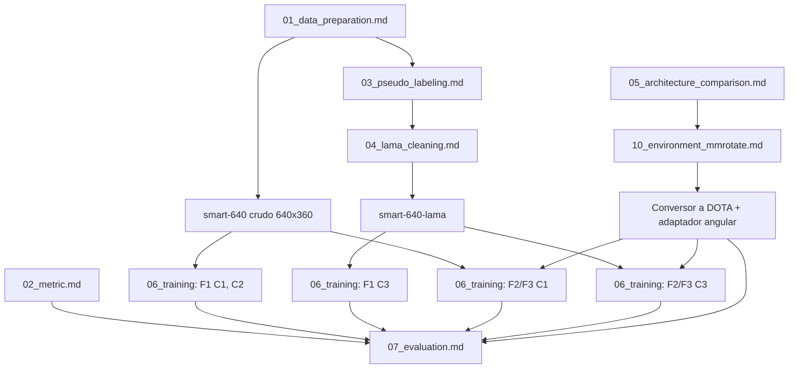
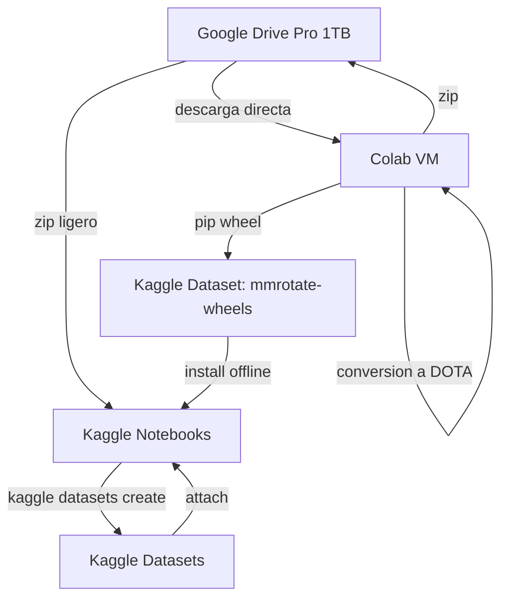

# Plan de Procedimiento - Resumen General (00_overview.md)

Este documento presenta la visión general y la estructura maestra del estudio. El objetivo es
evaluar si la limpieza de ruido de etiquetas mediante inpainting generativo (LaMa) mejora la
detección y clasificación de vehículos con cajas delimitadoras orientadas (OBB) **de forma
independiente de la familia arquitectónica del detector**, sobre el dataset SMART Challenge 2026
(MTC Perú).

> [!NOTE]
> **Cambio de alcance vigente.** La Fase 2 original (aumentación generativa armonizada con
> IC-Light) fue **descartada** y reemplazada por una comparativa entre tres familias de detectores
> orientados. El documento original se conserva en
> `_descartado/05_augmentation_iclight_descartado.md` y su fundamentación sobre volumen sintético
> pasa a la sección de Trabajo Futuro del artículo. La justificación del cambio está en
> `05_architecture_comparison.md` §1.

---

## 1. Resumen Ejecutivo

El tráfico urbano peruano es un problema abordable con visión computacional, pero el dataset del
SMART Challenge 2026 tiene una limitación crítica: **solo anota vehículos en movimiento**, y omite
sistemáticamente vehículos estacionados visualmente idénticos. Para el detector, cada auto
estacionado es una región con todas las características de la clase positiva etiquetada como
fondo: una señal contradictoria.

El estudio se articula en tres fases:

1. **Fase 0 (Pseudo-labeling):** detección exhaustiva de todos los vehículos y filtrado temporal
   con compensación del movimiento del dron, para aislar los vehículos estacionados omitidos.
2. **Fase 1 (Limpieza con LaMa):** remoción de esos vehículos y reconstrucción del fondo vial con
   Large Mask Inpainting, sin modificar las anotaciones.
3. **Fase 2 (Comparativa arquitectónica):** entrenamiento de tres detectores de familias disjuntas
   sobre el dataset crudo y sobre el limpiado, para medir si la ganancia de la limpieza es
   universal y qué mecanismo la modula.

---

## 2. Hipótesis

El ruido de etiquetas por omisión sistemática es una limitación **del dataset** y no de la
arquitectura elegida. En consecuencia, la limpieza con LaMa incrementa el Macro AP-rIoU@[0.50:0.80]
sobre un `val` real e inalterado en las tres familias, y la magnitud de esa ganancia está
gobernada por cómo cada familia convierte un objeto no anotado en señal de entrenamiento:

$$\Delta_{\text{S²A-Net}} > \Delta_{\text{YOLO26}} > \Delta_{\text{Oriented R-CNN}}$$

donde $\Delta_F = \text{AP}(\text{C3 limpia}) - \text{AP}(\text{C1 cruda})$. El orden se predice
porque S²A-Net pondera los negativos densos con Focal Loss, que amplifica justamente el negativo
más difícil (un objeto real etiquetado como fondo); YOLO26 usa negativos densos sin sobre-ponderar
los difíciles; y Oriented R-CNN **muestrea** sus negativos, diluyendo estadísticamente el ruido. El
desarrollo completo está en `05_architecture_comparison.md` §4.

---

## 3. Las Tres Familias Comparadas

El eje de la taxonomía es **cómo el detector accede a los features del objeto rotado**, porque ahí
radica la dificultad propia de la detección orientada: los features convolucionales están alineados
a los ejes de la imagen y los objetos no.

| Familia | Mecanismo | Modelo | mAP DOTA de referencia |
|---|---|---|---|
| **F1** Dense end-to-end real-time | Sin alineación explícita; predice el OBB desde features axis-aligned, sin NMS | `YOLO26s-OBB` | — |
| **F2** Two-stage proposal-based | Alineación esparsa por RoI: propuestas rotadas (midpoint offset) + rotated RoIAlign | `Oriented R-CNN` R50-FPN | 75.87 % |
| **F3** Single-stage feature-aligned | Alineación densa en el feature map: AlignConv + Active Rotating Filters | `S²A-Net` R50-FPN | ~74.1 % |

> [!WARNING]
> La taxonomía preliminar etiquetaba F1 como "anchor-based" y F3 como "anchor-free". **Es
> incorrecta y no debe llegar al artículo:** YOLO26-OBB es anchor-free (asignación TAL + DFL) y
> S²A-Net sí usa un anchor cuadrado por posición. El eje anchor no separa F1 de F3. Ver
> `05_architecture_comparison.md` §2.

---

## 4. Grafo de Dependencias entre Tareas

### Flujos Paralelos

- **Flujo A (Métrica):** `02_metric.md` es independiente y arranca el Día 1.
- **Flujo B (Baselines F1):** las corridas de YOLO26 pueden lanzarse de inmediato sobre
  `smart-640`, sin esperar nada del eje arquitectónico. La secuencia ejecutable está en
  `11_training_runbook.md` S1-S4.
- **Flujo C (Limpieza en Colab):** LaMa corre en Colab con GPU mientras los entrenamientos corren
  en Kaggle.
- **Flujo D (Eje arquitectónico, ruta crítica nueva):** spike de instalación de `onedl-mmrotate` →
  wheels precompiladas → conversión a DOTA → test de equivalencia angular → corridas de F2 y F3.
  Este flujo es **bloqueante y secuencial**: es el riesgo de cronograma más alto del proyecto y
  debe iniciarse el Día 1 en paralelo con todo lo demás.

---

## 5. Infraestructura de Cómputo

| Plataforma | GPU | VRAM | RAM | Almacenamiento | Rol |
|---|---|---|---|---|---|
| **Kaggle Notebooks (×5)** | P100 / 2×T4 | 16-32 GB | 29 GB | 20 GB persistente + 73 GB scratch | Fase 0 (inferencia de pseudo-labeling) y las 7 corridas de entrenamiento. Cuota: 30 h/semana por cuenta; 9 h por sesión interactiva y 12 h en modo background. |
| **Google Colab Free (×5)** | T4 | 15-16 GB | ~12 GB | ~78 GB efímero | Fase 1 (LaMa masivo), construcción de las wheels de mmrotate, Grad-CAM y benchmark de latencia. |
| **Google Drive Pro (×1)** | N/A | N/A | N/A | 1 TB | Almacén central: datasets crudos, variantes procesadas en zip, pesos DOTA respaldados y checkpoints. |
| **VM local (GTX 1070)** | GTX 1070 | 8 GB | — | — | Desarrollo y tests del conversor a DOTA y de los adaptadores; corridas de humo con `batch=1`. |

---

## 6. Logística de Datos

1. El dataset crudo (`train.zip`, 40.3 GB) se descarga a una VM de Colab desde Drive (>100 MB/s de
   red interna de Google).
2. En Colab se ejecutan Fase 0 y Fase 1, con redimensionamiento a **640×360** (factor exacto de 3
   desde 1920×1080, que preserva la relación de aspecto) para ajustarse a la resolución de
   entrenamiento y al límite de 20 GB de almacenamiento persistente de Kaggle. **El filtro de
   remuestreo debe ser el mismo para la variante cruda y la variante LaMa**, o la diferencia de
   nitidez se confundiría con el efecto de la limpieza (riesgo R15).
3. Se genera además la **copia en formato DOTA** requerida por mmrotate.
4. Los zips ligeros se suben a Drive y se registran como Datasets privados de Kaggle, de modo que
   las 5 cuentas los monten con latencia cero.
5. Las wheels precompiladas de mmrotate se construyen una única vez en Colab y viven como Kaggle
   Dataset propio, para que ninguna corrida gaste cuota de GPU compilando `mmcv`.

Artefactos versionados resultantes: `smart-640` (43,392 frames de train y 10,873 de val),
`smart-640-lama`, sus equivalentes en formato DOTA, y `mmrotate-wheels`.

---

## 7. Cronograma de Ejecución (8 días)

> [!IMPORTANT]
> El cronograma se expresa en días relativos (D1…D8) porque el deadline original del 22 de julio de
> 2026 ya venció. **Falta fijar la nueva fecha de entrega y anclar D1**; hasta entonces las
> dependencias son válidas pero las fechas absolutas no.

Las tareas de la ruta crítica van marcadas con ★.

| Día | Colab (generativo/interactivo) | Kaggle (entrenamiento/inferencia) | Entregable |
|---|---|---|---|
| **D1** | ★ Descarga de `train.zip`. Parseo de `train.csv` a YOLO-OBB. ★ **Spike de instalación de `onedl-mmrotate`** y construcción de wheels. | ★ Validación de la métrica `Macro AP-rIoU` con casos sintéticos. | `smart_dataset.yaml`, tests de métrica aprobados, Kaggle Dataset `mmrotate-wheels`. |
| **D2** | ★ Inferencia zero-shot con pesos DOTA de las tres arquitecturas. ★ Conversor `YOLO-OBB → DOTA` con test de ida y vuelta. | ★ Inventario de datos (runbook S0) y correcciones al trainer (S1). ★ Lanzamiento de **F1 C1**. | Detecciones zero-shot de las 3 familias. F1 C1 entrenando. |
| **D3** | ★ Homografía inter-frame (ego-motion). ★ Pseudo-labeling y auditoría manual (50 clips). ★ **Adaptador angular + test de equivalencia rIoU ≥ 0.999**. | ★ Lanzamiento de **F1 C2**. ★ Corridas de humo de F2 y F3 (200 iteraciones). | `static_vehicles.json` validado, adaptadores con tests verdes. |
| **D4** | ★ LaMa inpainting en GPU. ★ Resize a 640×360 con el mismo filtro que la variante cruda y subida de `smart-640-lama`. | ★ Lanzamiento de **F2 C1** y **F3 C1**. | `smart-640-lama` en Drive y Kaggle. |
| **D5** | ★ Auditoría visual de LaMa (100 imágenes). | ★ Lanzamiento de **F1 C3**, **F2 C3** y **F3 C3**. | Auditoría aprobada, todas las corridas de C3 en marcha. |
| **D6** | ★ Grad-CAM de C1 vs C3 en las tres familias. ★ Benchmark de latencia en T4. | ★ Descarga de checkpoints y reintentos si hubo fallos. | Figuras de saliencia y tabla de eficiencia. |
| **D7** | ★ Cómputo de la métrica sobre las 10 filas condición×familia. ★ Bootstrap de intervalos de confianza por clip. | ★ Reintentos de corridas fallidas si hubo. | Tablas de $\Delta_F$, por clase y de eficiencia completas. |
| **D8** | ★ **DEADLINE.** Compilación de resultados y redacción en LaTeX. | N/A | Artículo listo para entrega. |

---

## 8. Índice de Documentos de Detalle

1. **[01_data_preparation.md](./01_data_preparation.md):** parseo, verificación estadística y split
   libre de fuga.
2. **[02_metric.md](./02_metric.md):** especificación matemática y unit testing de Macro AP-rIoU.
3. **[03_pseudo_labeling.md](./03_pseudo_labeling.md):** detección de recall, compensación de
   ego-motion y lógica de rastreo.
4. **[04_lama_cleaning.md](./04_lama_cleaning.md):** inpainting con LaMa y auditoría visual.
5. **[05_architecture_comparison.md](./05_architecture_comparison.md):** taxonomía de familias,
   selección de modelos, hipótesis mecanísticas, protocolo de comparación justa y matriz
   experimental.
6. **[06_training.md](./06_training.md):** evidencia empírica del piloto, hiperparámetros y recetas
   por framework de las 7 corridas, presupuesto de cómputo y gestión de checkpoints.
7. **[07_evaluation.md](./07_evaluation.md):** adaptadores de formato, filtro de movimiento, tablas
   de resultados, saliencia y latencia.
8. **[08_risks.md](./08_risks.md):** mapa de contingencia y priorización si el tiempo apremia.
9. **[10_environment_mmrotate.md](./10_environment_mmrotate.md):** entorno de F2/F3, instalación
   reproducible e interoperabilidad de formatos.
10. **[11_training_runbook.md](./11_training_runbook.md):** secuencia ejecutable de los siete
    entrenamientos, con criterios de salida y puntos de control por paso.
11. **[_descartado/05_augmentation_iclight_descartado.md](./_descartado/05_augmentation_iclight_descartado.md):**
    Fase 2 original con IC-Light, fuera de alcance.

---

## 9. Decisiones Técnicas Tomadas

| Decisión | Valor seleccionado | Justificación |
|---|---|---|
| **Modelo F1** | `YOLO26s-obb` | Aporta +2.4 mAP sobre `nano`, mientras que `medium` solo aporta +0.5 mAP al doble de costo. |
| **Modelo F2** | `Oriented R-CNN` R50-FPN | Arquetipo two-stage orientado: su RPN genera propuestas **rotadas** por midpoint offset a costo casi nulo, no es un Faster R-CNN con ángulo añadido. 75.87 % mAP en DOTA con R-50, superando a métodos con R-101. Tiene pesos DOTA para el zero-shot. |
| **Modelo F3** | `S²A-Net` R50-FPN | Arquetipo literal de feature alignment (AlignConv + ARF). Su paper aísla que AlignConv vale ~3 mAP por 1.41 GFLOPs y que mejora especialmente las categorías **densamente distribuidas**, que es la composición de nuestro dataset. El más estable de entrenar del grupo. |
| **Reserva de F3** | `Oriented RepPoints` (CVPR'22) | Estrictamente anchor-free, 75.97 % mAP (+1.85 sobre S²A-Net) y diseñado para objetos pequeños agrupados, pero su esquema APAA es más sensible al learning rate. Se añade solo si sobra cuota. |
| **Framework F2/F3** | `onedl-mmrotate` (PyTorch 2.x) | Un solo toolbox contiene los tres modelos, así que F2 y F3 comparten pipeline de datos y optimizador: la diferencia medida es arquitectónica, no de implementación. El MMRotate original está descontinuado y exige `mmdet<3.0.0`. |
| **Volumen de datos** | Dataset completo, 43,392 frames de train, **sin submuestrear** | Con early stopping el costo es el número de muestras hasta converger (~260 k en el piloto), no el tamaño de la época: submuestrear 5× haría las épocas 5× más cortas y exigiría ~5× más épocas, sin ahorro real. El submuestreo solo añadía riesgo metodológico (`06_training.md` §2.1). |
| **Presupuesto de épocas** | Tope de 40 con **`patience=5`** y `min_delta=0.001`, igual en las tres familias | El piloto converge en la época 6 y 33 épocas más aportaron ~0.01 de mAP. Igualar el *criterio de parada* en lugar del *número de épocas* es más defendible: un número fijo favorece arbitrariamente a la arquitectura que converge más lento. |
| **Resolución** | **640×360** en las tres familias, sobre lienzo 640×640 con letterbox | Factor exacto de 3 desde 1920×1080, así que preserva la relación de aspecto y el remapeo a coordenadas oficiales es exacto. 1920×1080 tiene 9× más píxeles y volvería el estudio imposible. Igualar los píxeles de entrada es el invariante más fuerte disponible entre frameworks distintos (`06_training.md` §3.1). |
| **Batch** | Por familia (96 en F1, 8 en F2/F3), idéntico entre condiciones de la misma familia | El piloto de F1 ya usa 13.6 de 15 GB de VRAM con batch 96; forzar un batch común de 16 desperdiciaría VRAM e invalidaría el piloto. Es diferencia declarada, no invariante, y no afecta a $\Delta_F$ porque este es intra-familia (`06_training.md` §5.2). |
| **Partición** | Aleatoria por clip (`seed=42`), 80/20 | Los frames de un clip comparten fondo; el split por clip evita fuga de datos. |
| **Ego-motion del dron** | Homografía ORB+RANSAC | Compensa el movimiento sutil del fondo antes de rastrear centroides. |
| **Aumento F1 C2** | `mosaic=1.0, mixup=0.15, copy_paste=0.3` | Valores estándar para datasets aéreos tipo DOTA. |
| **Aumento F1 C1/C3, F2/F3** | Solo geométrico (volteos + rotación libre) | Aísla el efecto de la limpieza: entre C1 y C3 lo único que cambia son los píxeles del dataset. |
| **C2 solo en F1** | Sí | Mosaic/mixup/copy-paste son específicos del pipeline de Ultralytics; replicarlos a mano en mmrotate introduciría una variable de implementación propia justo donde se necesita comparabilidad. |
| **Filtro de movimiento** | Post-procesamiento idéntico en las 3 familias | Los modelos detectan estacionados; el filtro permite evaluar limpiamente contra la métrica del MTC. |
| **Métrica reportada** | Solo `src/evaluation/metric.py` | Queda **prohibido** reportar el mAP interno de Ultralytics o de mmrotate: no son comparables entre sí ni con la métrica del challenge. |
| **Fase IC-Light** | Descartada | Se solapaba con `copy_paste`, introducía brecha de dominio que hacía inconcluyente un resultado negativo, y consumía la cuota de GPU que ahora financia el eje arquitectónico. |
