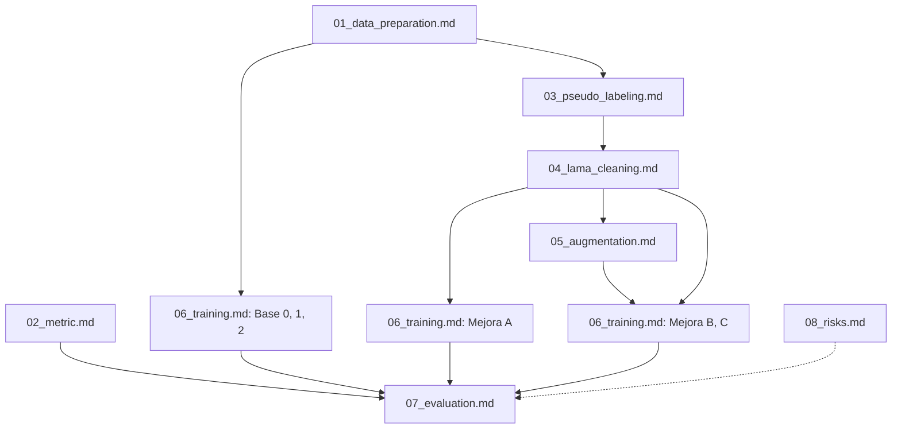
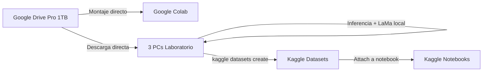

# Plan de Procedimiento - Resumen General (00_overview.md)

Este documento presenta la visión general y la estructura maestro del estudio de ablación para la detección y clasificación de vehículos mediante cajas delimitadoras orientadas (OBB). El objetivo principal del estudio es evaluar el impacto de la limpieza de ruido de etiquetas basada en modelos generativos de inpainting (LaMa) y la aumentación de datos generativos armonizados (IC-Light) utilizando el modelo YOLO26s-OBB sobre el dataset SMART Challenge 2026 (MTC Perú).

---

## 1. Resumen Ejecutivo
El tráfico en el contexto urbano peruano representa un desafío que puede ser abordado mediante visión computacional. Sin embargo, el dataset del SMART Challenge 2026 presenta una limitación crítica: **solo se anotan vehículos en movimiento**, omitiendo sistemáticamente vehículos estacionados idénticos en apariencia. Esto introduce una señal contradictoria en el entrenamiento.

Para solucionar este sesgo, se propone un pipeline compuesto de tres fases:
1. **Fase 0 (Pseudo-labeling):** Detección exhaustiva de todos los vehículos y filtrado temporal compensando el movimiento del dron para aislar vehículos estacionados omitidos.
2. **Fase 1 (Limpieza con LaMa):** Remoción de vehículos estacionados y reconstrucción del fondo vial con Large Mask Inpainting (LaMa).
3. **Fase 2 (Aumentación con IC-Light):** Extracción de recortes reales de clases minoritarias, composición sobre los fondos limpios y armonización de iluminación con IC-Light.

El estudio de ablación evaluará de forma rigurosa el aporte individual de estas fases a través de 6 condiciones experimentales en un entorno de hardware mixto y bajo un cronograma ajustado con deadline el **22 de julio de 2026**.

---

## 2. Hipótesis
La integración secuencial de limpieza de ruido de etiquetas (LaMa) y aumentación espacial armonizada (IC-Light) incrementará el Macro AP-rIoU@[0.50:0.80] del modelo YOLO26s-OBB en un set de validación real e inalterado. La limpieza elimina la penalización por detectar autos estacionados no anotados en el entrenamiento, mientras que la aumentación mitiga el desbalance extremo de las clases minoritarias sin generar un *domain gap* destructivo.

---

## 3. Grafo de Dependencias entre Tareas

### Flujos Paralelos:
- **Flujo A (Métrica):** `02_metric.md` puede implementarse y validarse de forma independiente en cualquier momento desde el Día 1.
- **Flujo B (Baselines):** `Base 0`, `Base 1` y `Base 2` de `06_training.md` pueden ejecutarse inmediatamente después de finalizar `01_data_preparation.md` sin esperar las fases de limpieza generativa.
- **Flujo C (Loma y Aumento):** La limpieza con LaMa (`04_lama_cleaning.md`) y la extracción de recortes se ejecutan en las PCs locales, mientras que los baselines entrenan en la nube (Kaggle).

---

## 4. Infraestructura de Cómputo

| Plataforma | GPU | VRAM | RAM | Almacenamiento | Rol Asignado |
|---|---|---|---|---|---|
| **PCs de Laboratorio (×3)** | GTX 1070 | 8 GB | 32 GB | HDD local | Preprocesamiento local (Fase 0 y Fase 1), preparación de recortes y evaluación final. |
| **Kaggle Notebooks (×5)** | P100 / 2×T4 | 16-32 GB | 29 GB | 20 GB (Persistente) + 60-90 GB (Scratch) | Entrenamientos paralelos de YOLO26s-OBB (las 5 condiciones de entrenamiento). Quota: 30h/semana por cuenta. |
| **Google Colab Free (×5)** | T4 | 15-16 GB | ~12 GB | ~100 GB (Efímero) | Inferencia con IC-Light, mapas Grad-CAM y benchmarks de ONNX/FP16. |
| **Google Drive Pro (×1)** | N/A | N/A | N/A | 1 TB (Nube) | Almacén central de datasets crudos, procesados y checkpoints de modelos. |

---

## 5. Logística de Datos

1. Los datasets crudos (`train.zip` de 40.3 GB) se descargan del Drive a las 3 PCs locales para evitar el estrangulamiento de red en la nube.
2. El preprocesamiento de LaMa y pseudo-labeling se realiza localmente. Las imágenes generadas se suben a Kaggle como un Dataset Privado una sola vez.
3. Las cuentas de Kaggle adjuntan este dataset directamente en sus entornos para los notebooks de entrenamiento.

---

## 6. Cronograma de Ejecución (8 Días: 15–22 de Julio)

Las tareas críticas de la ruta principal están marcadas con una estrella (★).

| Día | Tarea Paralela 1 (PC Local) | Tarea Paralela 2 (Kaggle/Colab) | Entregable |
|---|---|---|---|
| **Día 1** (15 Jul) | ★ Configuración de entornos locales en las 3 PCs del lab. ★ Parseo de `train.csv` y conversión a YOLO OBB. | ★ Implementación y validación de la métrica `Macro AP-rIoU` con casos sintéticos. | `smart_dataset.yaml` and tests of the metric passing. |
| **Día 2** (16 Jul) | ★ Entrenamiento local de YOLO26s-OBB ligero (Fase 0, 50 épocas). | ★ Subida del dataset crudo a Kaggle. ★ Lanzamiento de entrenamiento de **Base 1** (Data Cruda). | `yolo26s_pseudo.pt` en local. Inicios de entrenamiento. |
| **Día 3** (17 Jul) | ★ Inferencia y cálculo de ego-motion homografía. ★ Pseudo-labeling temporal y auditoría manual (50 clips). | ★ Lanzamiento de entrenamiento de **Base 2** (Aumento Clásico) en Kaggle. | JSON con máscaras de autos estacionados validadas. |
| **Día 4** (18 Jul) | ★ Ejecución paralela de LaMa en las 3 PCs (1.5 horas). ★ Extracción de recortes deduplicados. | ★ Implementación local del post-procesamiento del Filtro de Movimiento. | `dataset_lama_cleaned/` listo localmente. |
| **Día 5** (19 Jul) | Subida de Dataset LaMa y Recortes a Kaggle/Drive. | ★ Armonización de imágenes compuestas con IC-Light en Colab. ★ Lanzamiento de **Mejora A** (Data LaMa). | Dataset sintético armonizado y Mejora A entrenando. |
| **Día 6** (20 Jul) | Preparación final de los sets integrados. | ★ Lanzamiento de **Mejora B** (Cruda+Sintéticos) y **Mejora C** (Pipeline Completo). | Todos los modelos en entrenamiento. |
| **Día 7** (21 Jul) | ★ Descarga de pesos finales y corrida de evaluación completa de las 6 condiciones (métrica + filtro de movimiento). | ★ Extracción de Grad-CAM de saliencia. ★ Benchmark ONNX/FP16 en T4. | Tabla completa de AP por clase y figuras de diagnóstico. |
| **Día 8** (22 Jul) | ★ **DEADLINE.** Compilación de resultados, redacción del borrador en LaTeX e integración. | N/A | Artículo listo para entrega. |

---

## 7. Índice de Documentos de Detalle

Para ver las especificaciones de diseño y flujos de trabajo de cada fase, consulte los siguientes archivos:

1. **[01_data_preparation.md](file:///home/alvaro9rqc/1_Pacha/1-unsa/7_S/ia/article/.alvaro/01_procedimiento/plan/01_data_preparation.md):** Parseo, verificación estadística del dataset y split libre de fuga de datos.
2. **[02_metric.md](file:///home/alvaro9rqc/1_Pacha/1-unsa/7_S/ia/article/.alvaro/01_procedimiento/plan/02_metric.md):** Especificación matemática y unit testing de Macro AP-rIoU.
3. **[03_pseudo_labeling.md](file:///home/alvaro9rqc/1_Pacha/1-unsa/7_S/ia/article/.alvaro/01_procedimiento/plan/03_pseudo_labeling.md):** Detección de recall, ego-motion compensation y lógica de rastreo.
4. **[04_lama_cleaning.md](file:///home/alvaro9rqc/1_Pacha/1-unsa/7_S/ia/article/.alvaro/01_procedimiento/plan/04_lama_cleaning.md):** Inpainting con LaMa y auditoría visual.
5. **[05_augmentation.md](file:///home/alvaro9rqc/1_Pacha/1-unsa/7_S/ia/article/.alvaro/01_procedimiento/plan/05_augmentation.md):** Composición física realista y re-iluminación con IC-Light en Colab.
6. **[06_training.md](file:///home/alvaro9rqc/1_Pacha/1-unsa/7_S/ia/article/.alvaro/01_procedimiento/plan/06_training.md):** Configuración de hiperparámetros de las 6 condiciones experimentales.
7. **[07_evaluation.md](file:///home/alvaro9rqc/1_Pacha/1-unsa/7_S/ia/article/.alvaro/01_procedimiento/plan/07_evaluation.md):** Post-procesamiento temporal (filtro de movimiento) y diagnóstico de saliencia.
8. **[08_risks.md](file:///home/alvaro9rqc/1_Pacha/1-unsa/7_S/ia/article/.alvaro/01_procedimiento/plan/08_risks.md):** Mapa de contingencia y prioridades si el tiempo apremia.

---

## 8. Decisiones Técnicas Tomadas

| Decisión | Valor Seleccionado | Justificación Técnica |
|---|---|---|
| **Modelo Principal** | `YOLO26s-obb` | Aporta **+2.4 mAP** sobre la versión `nano`, mientras que pasar a la versión `medium` solo aporta **+0.5 mAP** a costa del doble de tiempo y recursos. |
| **Tamaño de Imagen** | `imgsz=640` | Permite entrenar con un batch size estable (batch=16 en Kaggle, batch=4 en GTX 1070 local) controlando el consumo de VRAM y previniendo errores OOM. |
| **Partición** | Aleatoria por Clip (`seed=42`) | Los frames de un mismo clip comparten el mismo fondo. El split a nivel de clip (80% train, 20% val) evita que frames del mismo clip terminen en ambos lados (*data leakage*). |
| **Dron Ego-motion** | Homografía ORB+RANSAC | Al grabarse desde un dron, el fondo se mueve sutilmente. El cálculo de la homografía permite compensar este movimiento antes de rastrear el centroide de los vehículos. |
| **Aumento Base 2** | `mosaic=1.0, mixup=0.15, copy_paste=0.3` | Hiperparámetros estándar e intermedios para aumentación clásica en datasets de teledetección/aéreos (DOTA). |
| **Aumento Mejora A/B/C** | Mínima (Sin Mosaic/MixUp/Copy-Paste) | Se desactivan las aumentaciones clásicas de YOLO para aislar y medir de forma pura el impacto de nuestras técnicas generativas. |
| **Ratio de Sintéticos** | Máx 50% por clase minoritaria | No superar 50% de la clase minoritaria y un límite de 1× de oversampling para buses articulados debido a la escasez de vehículos únicos (~5). |
| **Filtro de Movimiento** | Post-procesamiento idéntico en evaluación | Los modelos entrenados detectan vehículos estacionados. Se aplica un filtro de movimiento en inferencia para evaluar limpiamente contra la métrica de MTC. |
