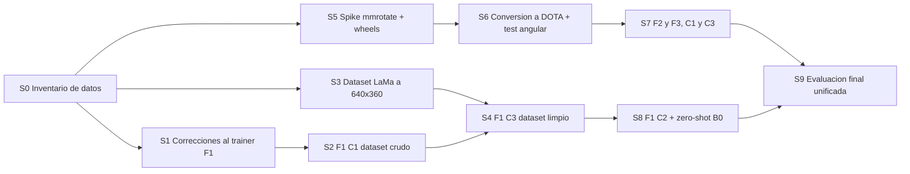

# Runbook de Entrenamiento (11_training_runbook.md)

Secuencia ejecutable de los siete entrenamientos y las tres evaluaciones zero-shot. `06_training.md`
define **qué** valores usar y por qué; este documento define **qué comandos correr y en qué orden**,
con los criterios de salida de cada paso.

El entrenamiento es la parte más lenta del proyecto, así que el orden está diseñado para que lo
bloqueante y lo barato ocurra primero, y para que nada caro se lance sobre una infraestructura no
verificada.

---

## 0. Ruta crítica de un vistazo



Los dos carriles son independientes hasta S9: **S1→S2→S4 (YOLO) y S5→S6→S7 (mmrotate) avanzan en
paralelo**, en cuentas distintas y por personas distintas. Ese paralelismo es lo que hace que el
cronograma quepa.

---

## S0. Inventario y verificación de datos (30 min, sin GPU)

Antes de gastar un minuto de cuota hay que confirmar qué hay realmente en el dataset de Kaggle. La
estructura esperada, bajo `/kaggle/input/mtc-challenge/` (o
`/kaggle/input/datasets/alvaroquispeunsa/mtc-challenge/`):

```
├── train-001/train/              # Imágenes originales 1920×1080
├── train_resized/train/          # Imágenes 640×360 (las que se usan)
├── smart_lama_corrected/train/   # Imágenes limpiadas con LaMa  ← verificar resolución
├── yolo_obb_labels/{train,val}/  # Etiquetas YOLO-OBB normalizadas, ya divididas
├── smart_dataset.yaml
├── split_metadata.csv
└── train.csv
```

Comprobaciones, todas obligatorias:

1. **Conteos.** `yolo_obb_labels/train` debe tener ~43,392 `.txt` y `yolo_obb_labels/val` ~10,873.
   Cada `.txt` debe tener su `.jpg` homónimo en `train_resized/train` (los nombres son del tipo
   `v_009evckk5b_0000.jpg` / `.txt`). Un `.txt` sin imagen es un frame que Ultralytics descartará en
   silencio, desalineando el conteo entre C1 y C3.
2. **`train_resized/train` cubre train *y* val.** Es un directorio plano con todos los frames; el
   split vive en las etiquetas, no en las imágenes. Si solo cubriera el split de train, el `val`
   tendría que salir de `train-001` a 1920×1080, lo que rompería la resolución invariante.
3. **Resolución de `smart_lama_corrected/train`.** Este es el punto de mayor riesgo silencioso de
   todo el paso. Si las imágenes de LaMa están a 1920×1080, hay que reescalarlas a 640×360
   **con exactamente el mismo método de remuestreo que se usó para `train_resized`**
   (misma librería, mismo filtro de interpolación). Un filtro distinto entre C1 y C3 introduce una
   diferencia sistemática de nitidez que se confundiría con el efecto de LaMa, es decir,
   contaminaría el resultado principal del artículo. Si no consta qué filtro se usó, la salida
   segura es **regenerar ambas variantes a 640×360 en la misma corrida y con el mismo código**.
4. **Correspondencia uno a uno entre variantes.** `smart_lama_corrected/train` y
   `train_resized/train` deben contener el mismo conjunto de nombres de archivo. Si LaMa solo se
   aplicó a los frames con autos estacionados detectados, los frames faltantes deben copiarse sin
   modificar desde `train_resized`, de modo que C1 y C3 vean el **mismo número de imágenes**. Si C3
   entrenara con menos frames que C1, $\Delta_F$ mezclaría el efecto de limpieza con un efecto de
   volumen de datos.
5. **Presencia de `train_resized.zip`.** El código actual (`train_base_1.py`) espera un `.zip` y lo
   extrae a `/tmp`. Si en el dataset hay un directorio ya descomprimido, se pasa por `images_dir` y
   se deja `resized_zip_path` vacío; symlinkear es más rápido que descomprimir 43 k archivos.

**Salida:** una celda de notebook que imprime los conteos y las resoluciones, guardada en
`experiments/notebooks/training/00_data_inventory.ipynb`. Ningún entrenamiento se lanza sin esta
salida pegada en el issue correspondiente.

---

## S1. Correcciones al trainer de F1 (2 h, sin GPU)

Cambios en `experiments/src/training/`, todos derivados del análisis del piloto
(`06_training.md` §2 y §7):

| # | Cambio | Motivo |
|---|---|---|
| 1 | `epochs: 100 → 40`, `patience: 20 → 5` | El piloto converge en la época 6; 33 épocas extra dieron ~0.01 de mAP |
| 2 | `cache: True → False` | El log muestra `41.9GB RAM required […] not caching`: ya estaba degradando a disco, y el escaneo previo desperdicia un minuto por sesión |
| 3 | Guardia de rango DDP en el callback de subida | En DDP el callback corre en los dos procesos y duplica subidas a Drive |
| 4 | Subcarpeta de Drive por corrida, y pesos con nombre `f1_c1_best.pt` | Con un solo `last.pt` compartido, una corrida sobrescribe el checkpoint de otra: causa más probable del fallo del piloto |
| 5 | No reanudar desde el `last.pt` del piloto | Con `resume=True` Ultralytics lee los args del checkpoint e ignora las sobrescrituras, así que heredaría `epochs=100` |
| 6 | Verificar tamaño del checkpoint descargado antes de cargarlo | Un `.pt` truncado falla después de haber gastado los minutos de instalación |
| 7 | Parametrizar la condición (`c1`/`c2`/`c3`) por config | C2 y C3 solo difieren en dataset y perfil de aumentación; duplicar la clase invita a que se desincronicen |

**Salida:** `pytest experiments/src/training/` en verde, y un `--fast-dev-run` local o en Colab que
completa una época sobre el 1 % de los datos.

---

## S2. F1 C1 — YOLO26s-OBB sobre datos crudos (~3 h de GPU)

La primera corrida real. Se lanza primero por tres razones: es la más barata, tiene un piloto que la
valida, y ejerce toda la infraestructura de datos y checkpoints antes de comprometer cuota en las
corridas caras.

```bash
python -m src.training.trainers.train_base_1 --condition c1
```

Con la receta de `06_training.md` §5.3 en 2× Tesla T4. Puntos de control durante la corrida:

- Época 1 completada en **~15 min**. Si tarda mucho más, el cuello de botella es de I/O y hay que
  revisar los symlinks o subir `workers`.
- VRAM por GPU cerca de **13.6 GB**. Si aparece OOM, bajar `batch` a 64 y **anotarlo**, porque el
  mismo valor tendrá que usarse en C2 y C3.
- `mAP50-95` ≥ 0.70 hacia la época 4. Si está muy por debajo, algo falla en las etiquetas o en el
  emparejamiento imagen-etiqueta, no en los hiperparámetros.
- Early stopping esperado entre las épocas 11 y 16.

**Salida:** `f1_c1_best.pt`, `results.csv`, `args.yaml` y `pip freeze` en la subcarpeta de Drive de
la corrida.

---

## S3. Dataset LaMa a 640×360 (1-2 h, GPU solo si hay que reescalar)

Materializa `smart-640-lama` según lo verificado en S0: reescalado con el mismo filtro que
`train_resized`, y relleno con las imágenes originales para los frames que LaMa no tocó, de modo que
el conjunto de nombres coincida exactamente con el de `smart-640`.

**Salida:** Kaggle Dataset `smart-640-lama` con 43,392 + 10,873 nombres idénticos a los de
`smart-640`, y un conteo impreso que lo demuestra. El `val` **nunca** se toca con LaMa
(`04_lama_cleaning.md` §6).

---

## S4. F1 C3 — YOLO26s-OBB sobre datos limpios (~3 h de GPU)

Idéntico a S2 salvo el dataset. Requisito absoluto: **misma receta bit a bit**, incluido el `batch`
efectivo si en S2 hubo que reducirlo.

```bash
python -m src.training.trainers.train_base_1 --condition c3
```

**Salida:** `f1_c3_best.pt` y el primer $\Delta_{F1}$ preliminar, que ya se puede calcular con el
pipeline de `07_evaluation.md`. Este número es la primera evidencia real de la hipótesis del
artículo, así que conviene tenerlo pronto aunque las demás familias vayan atrás.

---

## S5. Spike de `onedl-mmrotate` y wheels (1 día, bloqueante para F2/F3)

Procedimiento completo en `10_environment_mmrotate.md` §3.1. Resumen operativo:

1. Instalar `onedl-mmrotate` y compilar `mmcv` **en Colab**, no en Kaggle, para no gastar cuota.
2. Empaquetar las wheels resultantes como Kaggle Dataset `mmrotate-wheels`, junto con
   `experiments/requirements-mmrotate.lock`.
3. Verificar en Kaggle que la instalación offline toma menos de 5 minutos y que
   `import mmcv.ops` funciona.
4. Descargar los checkpoints DOTA de Oriented R-CNN y S²A-Net y respaldarlos en Drive el mismo día
   (riesgo R14).

**Criterio de salida:** una inferencia de prueba con los pesos DOTA sobre una imagen del dataset,
que dibuje OBB visualmente correctas. Sin esta imagen, F2/F3 no se lanzan.

---

## S6. Conversión a DOTA y test de equivalencia angular (medio día, bloqueante)

Dos entregables de software de `05_architecture_comparison.md` §7:

1. `dota_converter.py`: YOLO-OBB normalizado → DOTA en píxeles absolutos, con test de ida y vuelta
   con error < 1e-6.
2. `adapters.py`: salida de mmrotate (le90, radianes) → formato canónico en grados $[0, 360)$, con
   el **factor de escala 3** hacia 1920×1080, y test de equivalencia con rIoU ≥ 0.999 sobre 100 OBB
   aleatorios incluidos los casos límite de ángulo negativo y $w < h$.

Este paso es bloqueante por una razón concreta: un error de convención angular no lanza excepción,
solo baja el AP. Sin el test verde, una corrida de 10 h podría producir un número sin sentido y
nadie lo notaría hasta comparar familias.

**Salida:** tests en verde y el dataset en formato DOTA publicado en Kaggle.

---

## S7. F2 y F3, condiciones C1 y C3 (~30-45 h de GPU repartidas en 4 cuentas)

Cuatro corridas independientes, una por cuenta (`06_training.md` §6.2), con la receta de
`06_training.md` §5.4.

**Antes de cada corrida, corrida de humo obligatoria de 200 iteraciones:**

- Confirma que la pérdida baja y no produce NaN con `lr=0.01`. Si diverge, bajar a `lr=0.005`
  **y aplicar el mismo cambio a la condición pareja de la familia**.
- Registra el pico de VRAM con `batch_size=4`. Si roza el límite, bajar a 2 en ambas condiciones.
- Cuesta minutos y protege corridas de diez horas.

Lanzamiento en 2 GPUs:

```bash
torchrun --nproc_per_node=2 tools/train.py <config> --launcher pytorch --amp
```

Se ejecuta con **"Save Version → Run All (background)"** para disponer de hasta 12 h por sesión.
Vigilar el tope operativo de 24 épocas de `06_training.md` §6.1: si llega a la época 20 sin early
stopping, se corta en la 24 y **se aplica el mismo tope a la condición pareja**.

**Salida:** cuatro checkpoints, cuatro `.log.json` de scalars, y cuatro `pip freeze` cuyo diff entre
C1 y C3 de una misma familia debe ser vacío.

---

## S8. F1 C2 y evaluaciones zero-shot B0 (~5 h de GPU)

Las corridas prescindibles, al final por diseño: si la cuota se agota, se sacrifican sin tocar
ninguna hipótesis (`08_risks.md` §3).

- **F1 C2:** receta de `06_training.md` §5.5 con la aumentación clásica. Puede necesitar más épocas
  que C1 porque mosaic y mixup hacen el problema más difícil por época; el tope de 40 y la paciencia
  de 5 se mantienen igual.
- **B0 ×3:** inferencia con los pesos DOTA de las tres arquitecturas más el mapeo de clases
  DOTA→SMART de `10_environment_mmrotate.md` §4.3. Solo inferencia, sin entrenamiento.

---

## S9. Evaluación final unificada

Ya especificado en `07_evaluation.md`. Lo que este runbook añade son los dos requisitos que suelen
olvidarse y que invalidarían la comparación:

1. **Todas** las predicciones pasan por `adapters.py`, se reescalan por 3 a 1920×1080 y se evalúan
   con `src/evaluation/metric.py` sobre el `val` real completo, con el filtro de movimiento y los
   mismos umbrales para las tres familias.
2. Se registran por corrida las **épocas consumidas**, los **parámetros**, los **GFLOPs** y la
   **latencia**, que son columnas obligatorias de las tablas del artículo
   (`05_architecture_comparison.md` §5.2).

---

## Resumen de cuota

| Paso | GPU | Horas esperadas | Puede paralelizarse con |
|---|---|---|---|
| S0, S1 | No | — | Todo |
| S2 F1 C1 | Sí | ~3 h | S5, S6 |
| S3 dataset LaMa | Quizá | ~1 h | S2, S5 |
| S4 F1 C3 | Sí | ~3 h | S5, S6, S7 |
| S5 spike mmrotate | Mínima | ~1 h | S2, S3, S4 |
| S6 conversión DOTA | No | — | S2, S4 |
| S7 F2/F3 ×4 | Sí | ~30-45 h en 4 cuentas | S8 |
| S8 C2 + B0 | Sí | ~5 h | S7 |
| S9 evaluación | Sí | ~3 h | — |

**Total ~45-55 h de GPU** sobre una capacidad de 150 h semanales. El límite real del cronograma no
es la cuota sino la latencia de la ruta crítica S5→S6→S7, cuya corrida más larga es de ~13 h.
